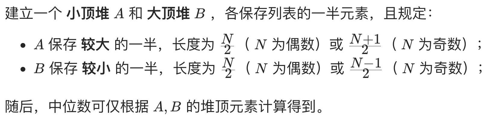
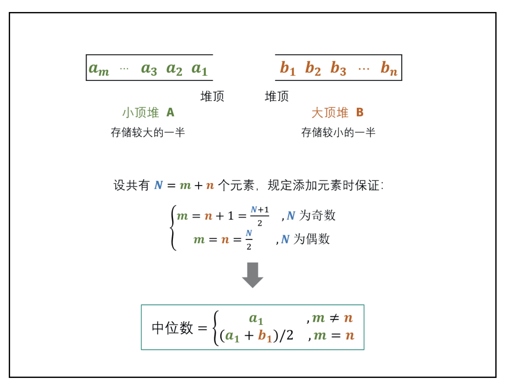

# [剑指 Offer 41. 数据流中的中位数](https://leetcode-cn.com/problems/shu-ju-liu-zhong-de-zhong-wei-shu-lcof/)

## 解题思路





## 复杂度分析

**时间复杂度：O(logN)**，堆的插入和弹出操作使用 O(log⁡N) 时间。

**空间复杂度：O(N)**，其中 N 为数据流中的元素数量，小顶堆 A 和大顶堆 B 最多同时保存 N 个元素。 

## 代码实现

```golang
type Heap []int

func (h Heap) Len() int { // 值接收者，处理方便
	return len(h)
}
func (h Heap) Swap(i, j int) { // 值接收者，处理方便
	h[i], h[j] = h[j], h[i]
}

func (h *Heap) Pop() interface{} { // 指针接收者，需要操作底层数组，若用值接收者则会拷贝一份底层数组操作
	v := (*h)[len(*h)-1]
	*h = (*h)[:len(*h)-1]
	return v
}

func (h *Heap) Push(v interface{}) { // 指针接收者，需要操作底层数组，若用值接收者则会拷贝一份底层数组操作
	*h = append(*h, v.(int))
}

type maxHeap struct { // 大顶堆
	Heap
}

func (m *maxHeap) Less(i, j int) bool { // 值接收者，处理方便
	return m.Heap[i] > m.Heap[j]
}

type minHeap struct { // 小顶堆
	Heap
}

func (m *minHeap) Less(i, j int) bool { // 值接收者，处理方便
	return m.Heap[i] < m.Heap[j]
}

type MedianFinder struct {
	LeftMax  *maxHeap // 前半部分数据构建大顶堆
	RightMin *minHeap // 后半部分数据构建小顶堆
}

/** initialize your data structure here. */
func Constructor() MedianFinder { // 工厂方法，返回对象值，不要返回指针，指针对象会逃逸到堆上
	m := new(MedianFinder)
	m.RightMin = new(minHeap)
	m.LeftMax = new(maxHeap)
	heap.Init(m.LeftMax)  // 注意初始化！利用 golang 的 heap 接口实现堆
	heap.Init(m.RightMin) // 注意初始化！利用 golang 的 heap 接口实现堆
	return *m
}

func (this *MedianFinder) AddNum(num int) {
	// 压入数据时有两种情况；
	// 1）原有数据为偶数个，则有 LeftMax.len() == RightMin.len()
	//   此时将数据放入 LeftMax
	//   高明之处：需先将数据放在 RightMin，再从 RightMin 中 pop 出一个元素，将其放入 LeftMax
	//   省去了判断 num 与 RightMin最小值 及 LeftMax最大值 的比较，通过比较判断 num 应该放在哪个 heap
	//   然后再根据左右 heap 的长度，对左右 heap 进行调整
	// 2) 原有数据为奇数个，则有 LeftMax.len() == RightMin.len() + 1
	//   此时将数据放入 RightMin
	//   类似上一步，需先将数据放在 LeftMax，再从 LeftMax 中 pop 出一个元素，将其放入 RightMin 中
	if this.LeftMax.Len() == this.RightMin.Len() {
		heap.Push(this.RightMin, num)
		heap.Push(this.LeftMax, heap.Pop(this.RightMin))
	} else {
		heap.Push(this.LeftMax, num)
		heap.Push(this.RightMin, heap.Pop(this.LeftMax))
	}
}

func (this *MedianFinder) FindMedian() float64 {
	if (this.RightMin.Len()+this.LeftMax.Len())%2 == 0 {
		// 取堆顶元素，直接从结构中取 Heap[0]，省去用 heap.Pop() 后再做类型断言了
		return float64(this.LeftMax.Heap[0]+this.RightMin.Heap[0]) / 2
	} else {
		// 取堆顶元素，直接从结构中取 Heap[0]，省去用 heap.Pop() 后再做类型断言了
		return float64(this.LeftMax.Heap[0])
	}
}
```