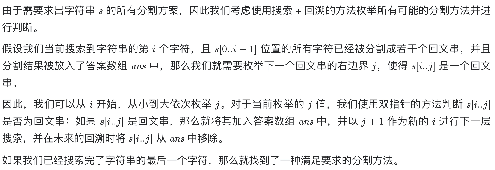

# [131. 分割回文串](https://leetcode-cn.com/problems/palindrome-partitioning/)

## 解题思路（回溯法+动态规划预处理）




## 复杂度分析

**时间复杂度：O(N*2^N)**

**空间复杂度：O(N^2)** 

## 代码实现

```golang
func partition(s string) (ans [][]string) {
	n := len(s)
	// 1、动态规划预处理，方便判断回文
	dp := make([][]bool, n)
	for i := range dp { // 初始化
		dp[i] = make([]bool, n)
		for j := range dp[i] {
			dp[i][j] = false
		}
	}
	for j := 0; j < n; j++ {
		for i := 0; i <= j; i++ { // 注意边界i<=j，且保证先遍历内层
			dp[i][j] = s[i] == s[j] && (j-i <= 2 || dp[i+1][j-1]) // 动态转移
		}
	}
	var splits []string
	var dfs func(int)
	// 2、深度优先搜索+回溯，枚举全部结果
	dfs = func(i int) {
		if i == n {
			ans = append(ans, append([]string(nil), splits...))
			return
		}
		for j := i; j < n; j++ {
			if dp[i][j] { // 如果s[i:j+1]是回文字符串
				splits = append(splits, s[i:j+1])
				dfs(j + 1)
				splits = splits[:len(splits)-1] // 回溯
			}
		}
	}
	dfs(0)
	return
}
```