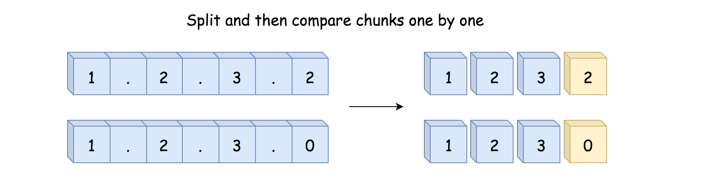
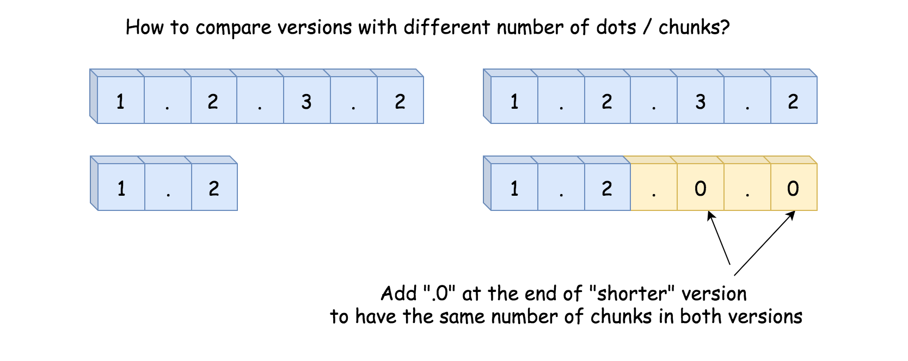
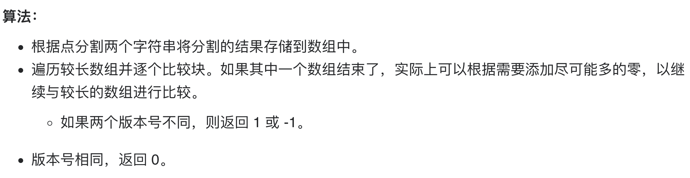
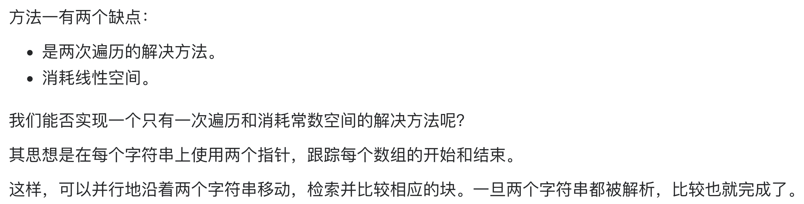
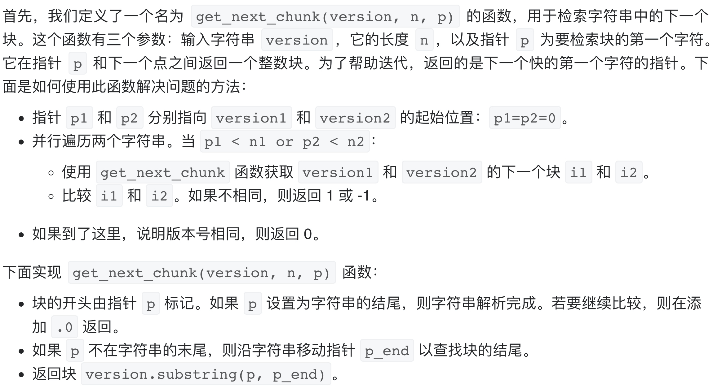

# [165. 比较版本号](https://leetcode-cn.com/problems/compare-version-numbers/)

## 方法一：分割+解析，两次遍历，线性空间

## 解题思路

第一个想法是将两个字符串按点字符分割成块，然后逐个比较这些块。



如果两个版本号的块数相同，则可以有效工作。如果不同，则需要在较短字符串末尾补充相应的 `.0` 块数使得块数相同。





## 复杂度分析

**时间复杂度：O(N+M+max(N,M))**

**空间复杂度：O(N+M)** 

## 代码实现

```golang
func compareVersion(version1 string, version2 string) int {
	nums1 := strings.Split(version1, ".")
	nums2 := strings.Split(version2, ".")
	n, m := len(nums1), len(nums2)
	for i := 0; i < n || i < m; i++ {
		n1, n2 := 0, 0
		if i < n { // 若越界，则该段默认为0
			n1, _ = strconv.Atoi(nums1[i])
		}
		if i < m { // 若越界，则该段默认为0
			n2, _ = strconv.Atoi(nums2[i])
		}
		if n1 > n2 {
			return 1
		}
		if n1 < n2 {
			return -1
		}
	}
	return 0
}
```

## 方法二：双指针，一次遍历，常数空间

## 解题思路





## 复杂度分析

**时间复杂度：O(max(N,M))**

**空间复杂度：O(1)** 

## 代码实现

```golang

```

