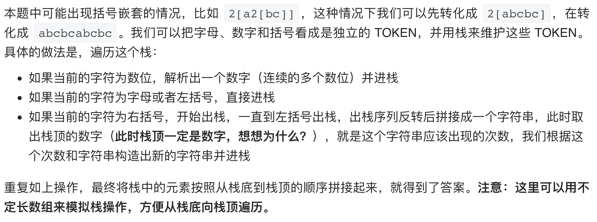

# [394. 字符串解码](https://leetcode-cn.com/problems/decode-string/)

## 解题思路（栈）



## 复杂度分析

**时间复杂度：O(S)**

**空间复杂度：O(S)** 

## 代码实现

```golang
func decodeString(s string) string {
	n := len(s)
	stack := make([]string, 0)
	idx := 0
	for idx < n {
		if s[idx] >= '0' && s[idx] <= '9' { // 数字
			num := 0
			for s[idx] >= '0' && s[idx] <= '9' { // 向后遍历截取完整数字
				num = num*10 + int(s[idx]-'0')
				idx++
			}
			stack = append(stack, strconv.Itoa(num))
		} else if (s[idx] >= 'a' && s[idx] <= 'z') || (s[idx] >= 'A' && s[idx] <= 'Z') || s[idx] == '[' { // 字符 或 "["
			stack = append(stack, string(s[idx]))
			idx++
		} else { // "]"
			strs := make([]string, 0)        // 注意此处是[]string而非[]byte，因为stack内为string不是byte，合并后的string会压入栈
			for stack[len(stack)-1] != "[" { // 将 "[" 与 "]" 中间的字符依次取出
				strs = append(strs, stack[len(stack)-1])
				stack = stack[0 : len(stack)-1]
			}
			stack = stack[0 : len(stack)-1] // 弹出 "["
			// 将取出的字符倒序（恢复顺序）
			for i := 0; i < len(strs)/2; i++ {
				strs[i], strs[len(strs)-1-i] = strs[len(strs)-1-i], strs[i]
			}
			s := "" // 将字符串数组合成一个字符串
			for i := 0; i < len(strs); i++ {
				s += strs[i]
			}
			repeatStr := ""
			num, _ := strconv.Atoi(stack[len(stack)-1]) // 获取压缩数字
			stack = stack[0 : len(stack)-1]             // 出栈数字
			for i := 0; i < num; i++ {
				repeatStr += s
			}
			stack = append(stack, repeatStr) // 拼接好的字符串重新入栈
			idx++                            // 注意下标自增
		}
	}
	res := "" // 栈内字符串顺序拼接
	for i := 0; i < len(stack); i++ {
		res += stack[i]
	}
	return res
}
```