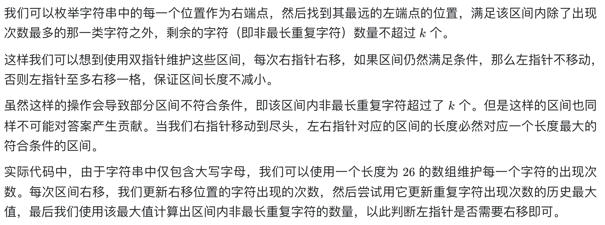

# [424. 替换后的最长重复字符](https://leetcode-cn.com/problems/longest-repeating-character-replacement/)

## 解题思路



## 复杂度分析

**时间复杂度：O(N)**，其中 n 是字符串的长度。我们至多只需要遍历该字符串一次。

**空间复杂度：O(∣Σ∣)**，其中 ∣Σ∣ 是字符集的大小。我们需要存储每个大写英文字母的出现次数。 

## 代码实现

```golang
func characterReplacement(s string, k int) int {
	cnt := [26]int{}
	maxCnt := 0
	left, right := 0, 0
	for right < len(s) {
		cnt[s[right]-'A']++
		maxCnt = max(maxCnt, cnt[s[right]-'A']) // 更新最大次数
		if right-left+1-maxCnt > k {            // 除最大次数字符以外的字符大于k时，窗口右移
			cnt[s[left]-'A']--
			left++
		}
		right++
	}
	return right - left // 注意此处不是 right-left+1，因为right溢出了1
}

func max(a, b int) int {
	if a > b {
		return a
	}
	return b
}
```