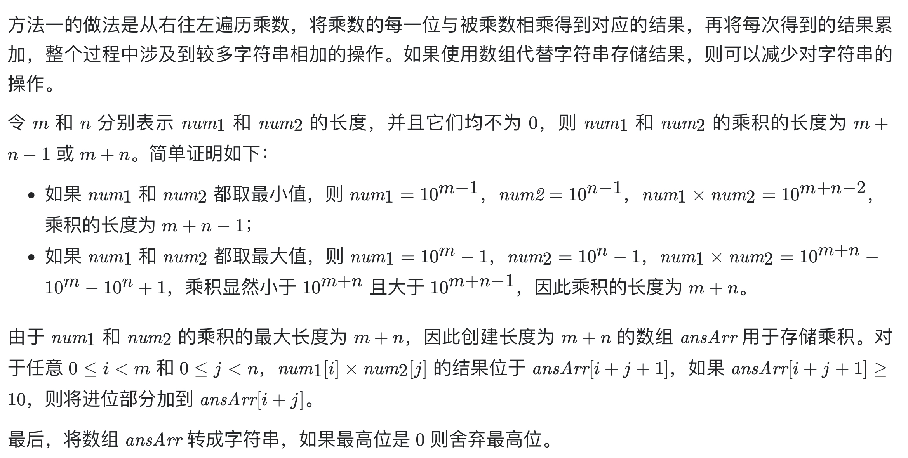

# [43. 字符串相乘](https://leetcode-cn.com/problems/multiply-strings/)

## 解题思路



## 复杂度分析

**时间复杂度：O(NM)**

**空间复杂度：O(N+M)** 

## 代码实现

```golang
func multiply(num1 string, num2 string) string {
	if num1 == "0" || num2 == "0" { // 特判
		return "0"
	}
	n, m := len(num1), len(num2)
	ansArr := make([]int, n+m)
	for i := n - 1; i >= 0; i-- {
		x := int(num1[i]) - '0'
		for j := m - 1; j >= 0; j-- {
			y := int(num2[j] - '0')
			ansArr[i+j+1] += x * y // nums1[i]*nums[j]的结果，放入ansArr[i+j+1]，注意此处是+=，因为i+j+1可能对应多种组合
		}
	}
	for i := n + m - 1; i > 0; i-- { // 进位处理
		ansArr[i-1] += ansArr[i] / 10
		ansArr[i] %= 10
	}
	ans, idx := "", 0
	for ansArr[idx] == 0 { // 跳过前导零
		idx++
	}
	for idx < m+n {
		ans += strconv.Itoa(ansArr[idx])
		idx++
	}
	return ans
}
```