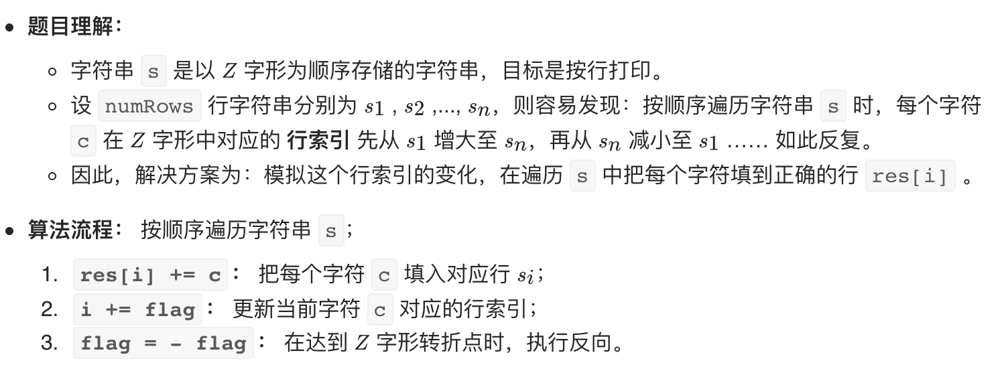
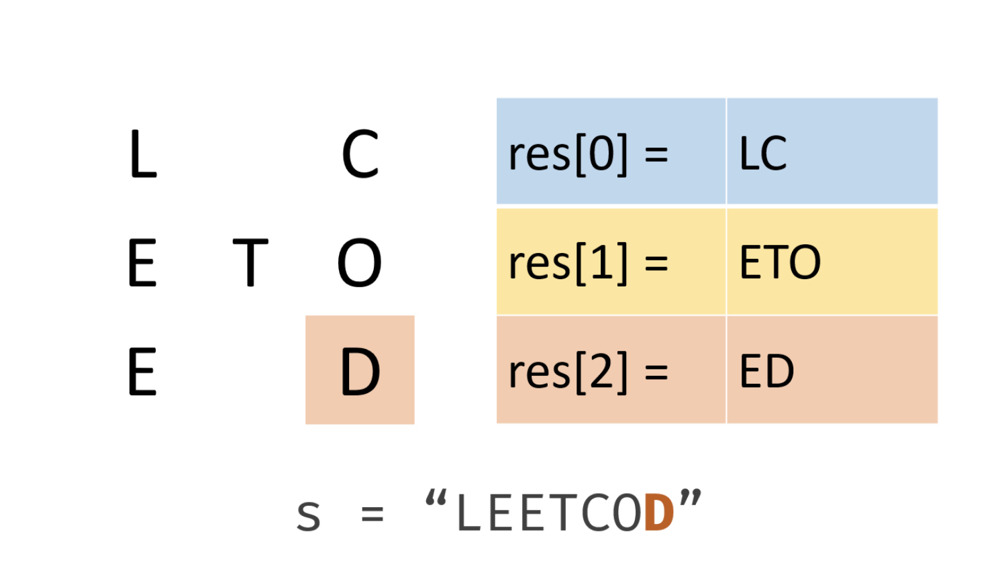

# [6. Z 字形变换](https://leetcode-cn.com/problems/zigzag-conversion/)

## 解题思路





## 复杂度分析

**时间复杂度：O(N)**

**空间复杂度：O(N)** 

## 代码实现

```golang
func convert(s string, numRows int) string {
	if numRows < 2 { // 特判
		return s
	}
	lines := make([]string, numRows)
	row := 0
	flag := -1 // 注意初始化为-1
	for i := 0; i < len(s); i++ {
		lines[row] += string(s[i])
		if row == 0 || row == numRows-1 { // 到达转向点
			flag = -1 * flag
		}
		row += flag
	}
	return strings.Join(lines, "")
}
```