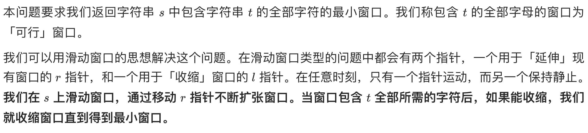
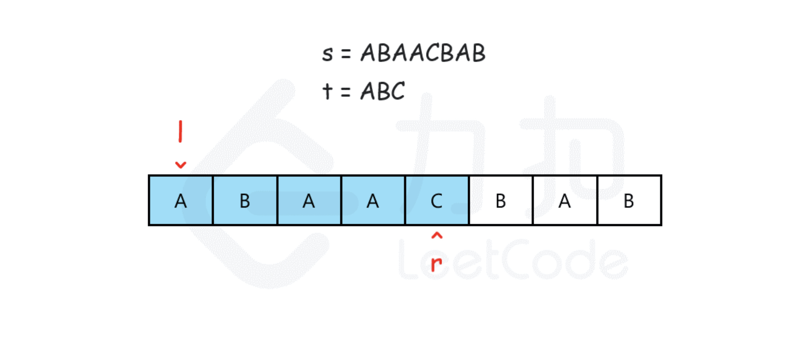
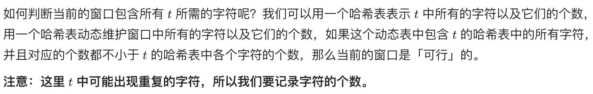

# [76. 最小覆盖子串](https://leetcode-cn.com/problems/minimum-window-substring/)

## 解题思路







## 复杂度分析

**时间复杂度：O(C\*|s|+|t|)**，最坏情况下左右指针对 s 的每个元素各遍历一遍，哈希表中对 s 中的每个元素各插入、删除一次，对 t 中的元素各插入一次。每次检查是否可行会遍历整个 t 的哈希表，哈希表的大小与字符集的大小有关，设字符集大小为 C，则渐进时间复杂度为O(C*|s|+|t|)。

**空间复杂度：O(C)**，这里用了两张哈希表作为辅助空间，每张哈希表最多不会存放超过字符集大小的键值对，我们设字符集大小为 C ，则渐进空间复杂度为 O(C)。 

## 代码实现

```golang
func minWindow(s string, t string) string {
	ori, cnt := map[byte]int{}, map[byte]int{}
	for i := 0; i < len(t); i++ { // 统计目标串的字符分布
		ori[t[i]]++
	}
	sLen := len(s)
	len := math.MaxInt32
	ansL, ansR := -1, -1
	check := func() bool { // 判断当前窗口内是否包含目标串的所有字符
		for k, v := range ori {
			if cnt[k] < v {
				return false
			}
		}
		return true
	}
	for l, r := 0, 0; r < sLen; r++ {
		if ori[s[r]] > 0 { // 统计窗口内在目标串中的字符数量
			cnt[s[r]]++
		}
		for check() && l <= r { // 缩减窗口直至不包含完整目标串字符
			if r-l+1 < len { // 更新最小窗口
				len = r - l + 1
				ansL, ansR = l, l+len
			}
			if ori[s[l]] > 0 { // 缩减窗口，若移除的字符在目标串中
				cnt[s[l]] -= 1
			}
			l++
		}
	}
	if ansL == -1 {
		return ""
	}
	return s[ansL:ansR]
}
```