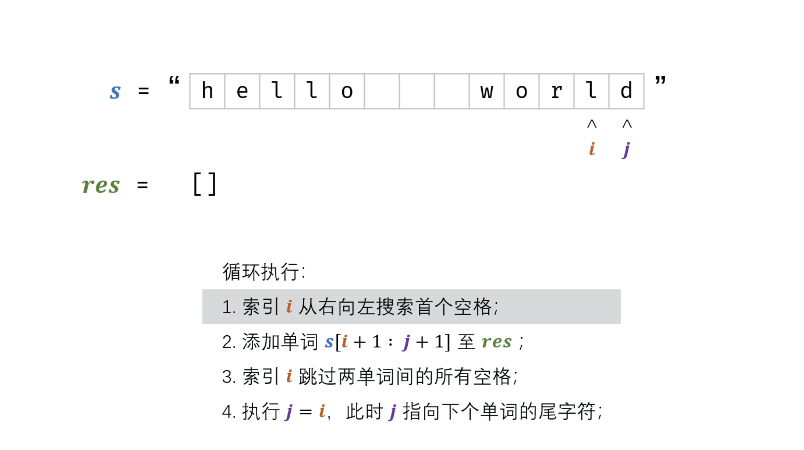

# [剑指 Offer 58 - I. 翻转单词顺序](https://leetcode-cn.com/problems/fan-zhuan-dan-ci-shun-xu-lcof/)

## 解题思路

**双指针+倒序遍历**，倒序遍历字符串 s ，记录单词左右索引边界 i,j；每确定一个单词的边界，则将其添加至单词列表 res；最终，将单词列表拼接为字符串，并返回即可。



## 复杂度分析

**时间复杂度：O(N)**

**空间复杂度：O(N)** 

## 代码实现

```golang
func reverseWords(s string) string {
	s = strings.Trim(s, " ") // 删除首尾空格
	n := len(s)
	if n == 0 {
		return ""
	}
	i, j := n-1, n-1
	res := ""
	for i >= 0 {
		for i >= 0 && s[i] != ' ' { // 搜索首个空格
			i--
		}
		res += s[i+1:j+1] + " "
		for i >= 0 && s[i] == ' ' { // 跳过单次间空格
			i--
		}
		j = i // j 指向下一个单词的尾字符
	}
	return res[:len(res)-1] // 注意去除最后的空格
}
```
