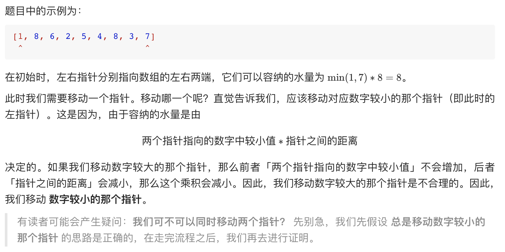
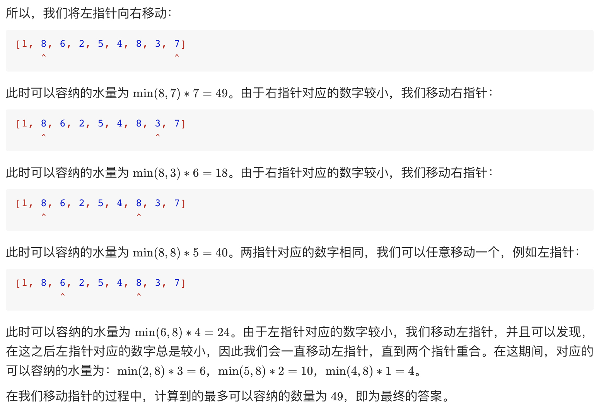
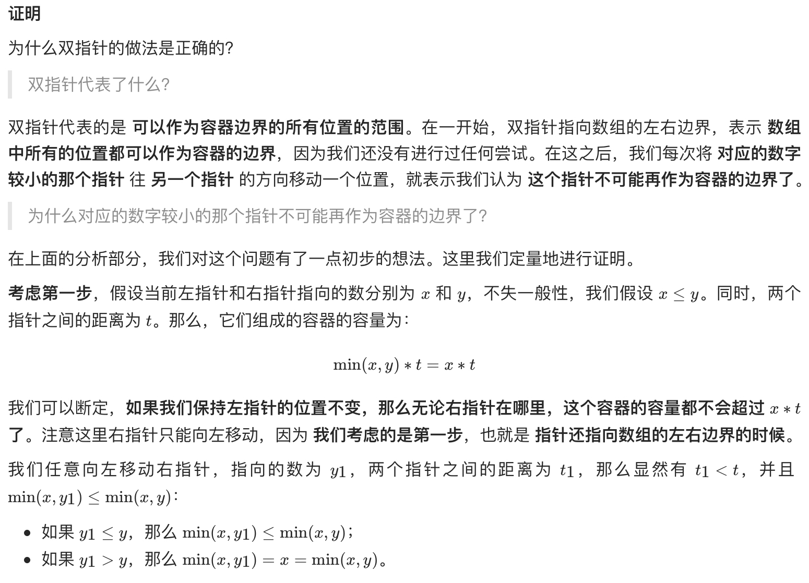
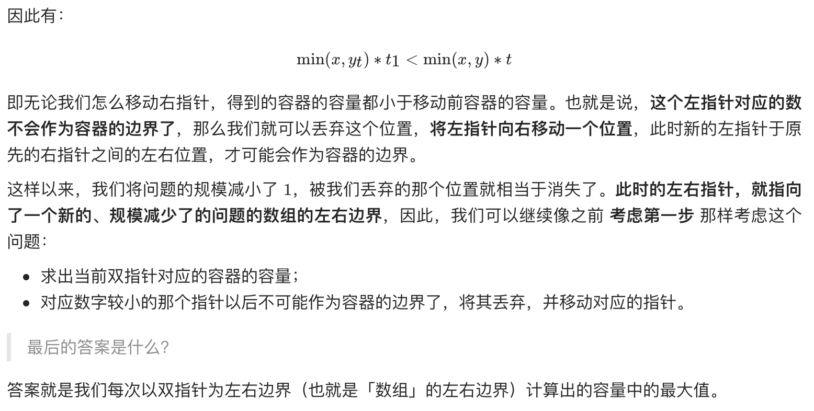

# [11. 盛最多水的容器](https://leetcode-cn.com/problems/container-with-most-water/)

## 解题思路

本题是一道经典的面试题，最优的做法是使用「双指针」。如果读者第一次见这题，不一定能想出双指针的做法。









## 复杂度分析

**时间复杂度：O(N)**

**空间复杂度：O(1)** 

## 代码实现

```golang
func maxArea(height []int) int {
	left, right := 0, len(height)-1
	area, maxArea := 0, 0
	for left < right {
		if height[left] <= height[right] {
			area = height[left] * (right - left)
			left++
		} else {
			area = height[right] * (right - left)
			right--
		}
		if area > maxArea {
			maxArea = area
		}
	}
	return maxArea
}
```