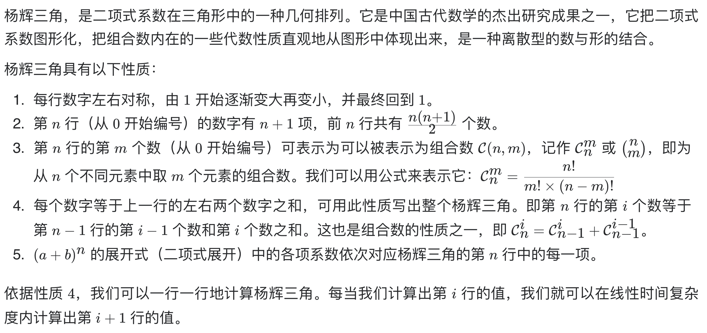

# [118. 杨辉三角](https://leetcode-cn.com/problems/pascals-triangle/)

## 解题思路



## 复杂度分析

**时间复杂度：O(N^2)**

**空间复杂度：O(1)** 

## 代码实现

```golang
func generate(numRows int) [][]int {
	ans := make([][]int, numRows)
	for i := 0; i < numRows; i++ {
		ans[i] = make([]int, i+1)
		ans[i][0] = 1            // 初始化最左元素
		ans[i][i] = 1            // 初始化最右元素
		for j := 1; j < i; j++ { // 从每行第二个元素遍历至倒数第二个元素
			ans[i][j] = ans[i-1][j-1] + ans[i-1][j]
		}
	}
	return ans
}
```