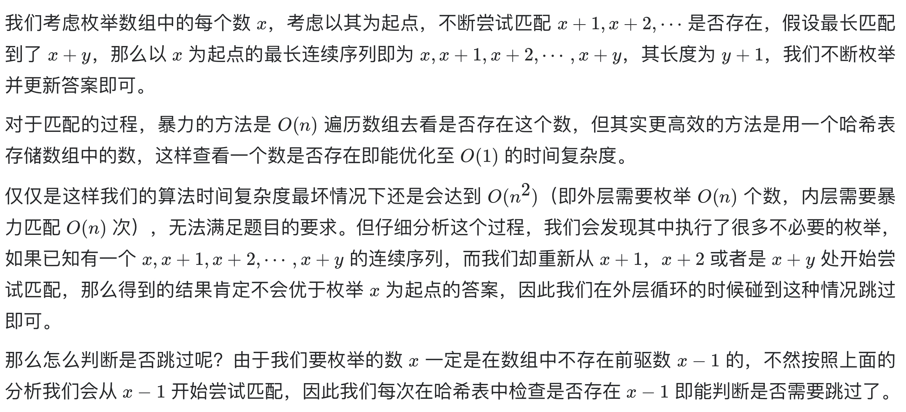

# [128. 最长连续序列](https://leetcode-cn.com/problems/longest-consecutive-sequence/)

## 解题思路（哈希表）



## 复杂度分析

**时间复杂度：O(N)**

**空间复杂度：O(N)** 

## 代码实现

```golang
func longestConsecutive(nums []int) int {
	numSet := map[int]bool{}
	for _, num := range nums {
		numSet[num] = true
	}
	max := 0
	for num := range numSet { // 注意此处遍历的是 numSet（数据已去重），而非 nums
		if !numSet[num-1] { // 若 nums[i]-1 存在，则最优解应该从 nums[i]-1 开始计数，防止无效计算
			j, cnt := num, 1
			for numSet[j+1] {
				j++
				cnt++
			}
			if max < cnt {
				max = cnt
			}
		}
	}
	return max
}
```