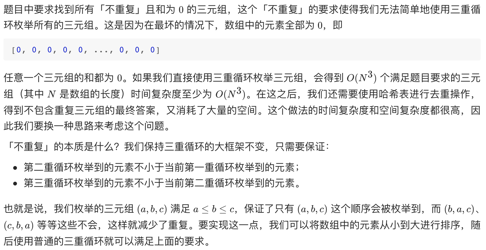
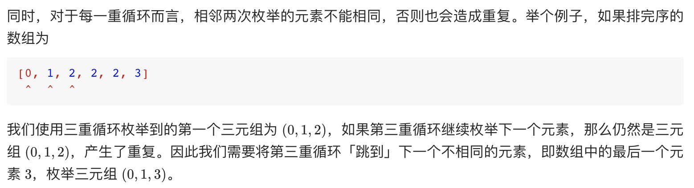
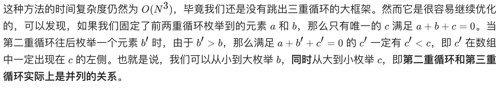

# [15. 三数之和](https://leetcode-cn.com/problems/3sum/)

## 解题思路







**优化思想**：当第一重循环选定值 a 时，只需要 b+c=-a 即可满足要求，于是问题转换为，在剩余的有序数组中，查找两数之和为固定值，即**有序数组中两数之和问题**，参考题目 [剑指 Offer 57. 和为s的两个数字](https://github.com/WTongStudio/LeetCode/blob/master/数据结构/数组/剑指%20Offer%2057.%20和为s的两个数字.md) 同样可以使用双指针实现。

注意到还有第一重循环，时间复杂度为 O(N)，因此枚举的总时间复杂度为 O(N^2 )。由于排序的时间复杂度为 O(NlogN)，在渐进意义下小于前者，因此算法的总时间复杂度为 O(N^2 )。

## 复杂度分析

**时间复杂度：O(N^2)**

**空间复杂度：O(logN)**，我们忽略存储答案的空间，额外的排序的空间复杂度为 O(logN)。然而我们修改了输入的数组 nums，在实际情况下不一定允许，因此也可以看成使用了一个额外的数组存储了 nums 的副本并进行排序，空间复杂度为 O(N)。

## 代码实现

```golang
func threeSum(nums []int) [][]int {
	n := len(nums)
	sort.Ints(nums) // 先排序
	ans := make([][]int, 0)
	// 枚举 a
	for first := 0; first < n; first++ {
		// 需要和上一次枚举的数不相同
		if first > 0 && nums[first] == nums[first-1] {
			continue
		}
		// c 对应的指针初始指向数组的最右端
		third := n - 1
		target := -1 * nums[first] // 当选定第一个数 nums[first] 时，后两个数之和的目标为 -1 * nums[first]
		// 之后问题转换为有序数组的两数之和问题，可使用双指针解决
		// 枚举 b
		for second := first + 1; second < n; second++ {
			// 需要和上一次枚举的数不相同
			if second > first+1 && nums[second] == nums[second-1] {
				continue
			}
			// 需要保证 b 的指针在 c 的指针的左侧
			for second < third && nums[second]+nums[third] > target {
				third--
			}
			// 如果指针重合，随着 b 后续的增加
			// 就不会有满足 a+b+c=0 并且 b<c 的 c 了，可以退出循环
			if second == third {
				break
			}
			if nums[second]+nums[third] == target {
				ans = append(ans, []int{nums[first], nums[second], nums[third]})
			}
		}
	}
	return ans
}
```

## 相关问题

[剑指 Offer 57. 和为s的两个数字](https://github.com/WTongStudio/LeetCode/blob/master/数据结构/数组/剑指%20Offer%2057.%20和为s的两个数字.md)

