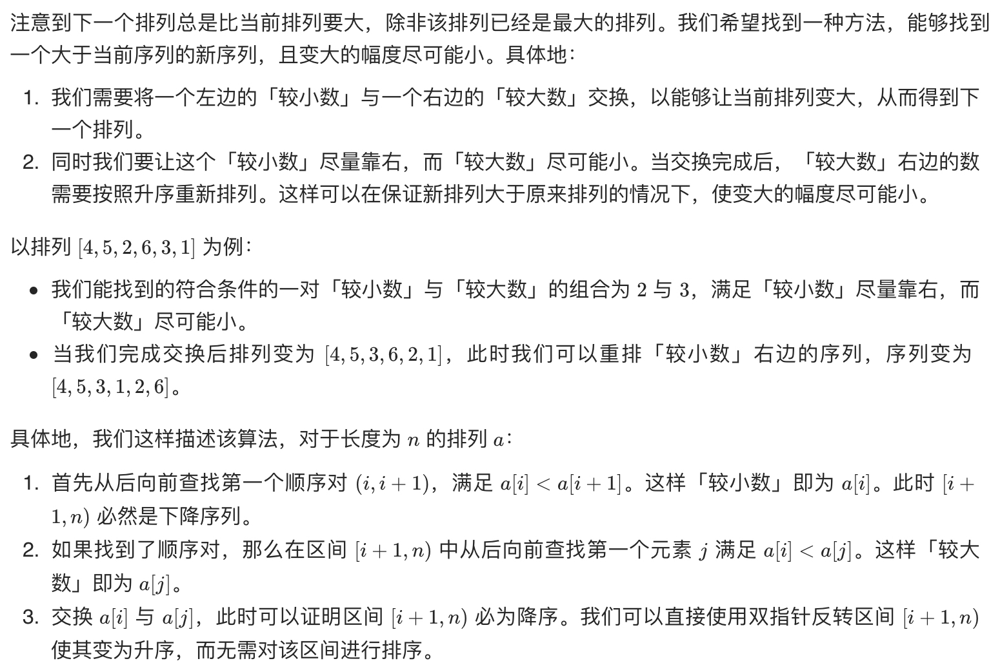

# [31. 下一个排列](https://leetcode-cn.com/problems/next-permutation/)

## 解题思路



## 复杂度分析

**时间复杂度：O(N)**

**空间复杂度：O(1)** 

## 代码实现

```golang
func nextPermutation(nums []int) {
	n := len(nums)
	i := n - 2                           // 向左遍历，i 从倒数第二开始是为了 nums[i+1] 要存在
	for i >= 0 && nums[i] >= nums[i+1] { // 从后向前寻找第一个小于右邻居的数，为了尽可能靠右
		i--
	}
	if i >= 0 { // 若这个数在数组中存在，从它身后挑一个数，和它交换
		j := n - 1
		for j > i && nums[i] >= nums[j] { // 寻找第一个大于 nums[i] 的数，后半段一定递减，倒着遍历就是递增，并且不会达到 i+1
			j--
		}
		nums[i], nums[j] = nums[j], nums[i]
	} // 如果 i = -1，说明是递减排列，如 3 2 1，没有下一排列，直接翻转为最小排列：1 2 3
	reverse(nums[i+1:])
}

func reverse(a []int) { // 反转切片
	n := len(a)
	for i := 0; i < n/2; i++ { // 前后交换
		a[i], a[n-1-i] = a[n-1-i], a[i]
	}
}
```