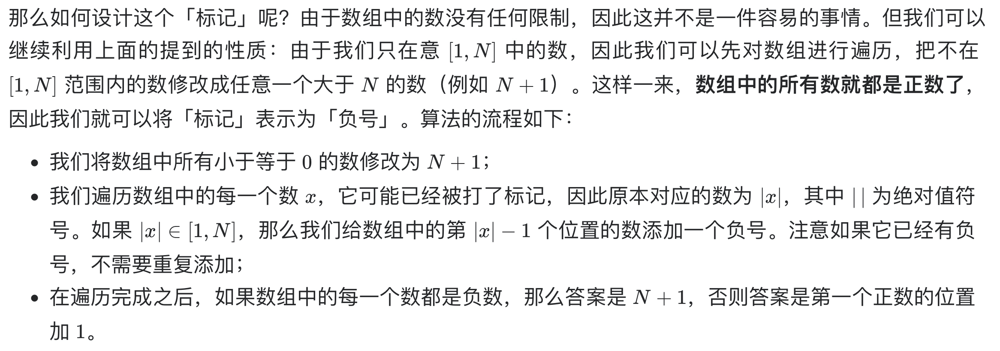

# [41. 缺失的第一个正数](https://leetcode-cn.com/problems/first-missing-positive/)

## 解题思路

「真正」满足时间复杂度为 O(N) 且空间复杂度为 O(1) 的算法是不存在的，但是我们可以退而求其次：**利用给定数组中的空间来存储一些状态**。也就是说，如果题目给定的数组是**不可修改的**，那么就不存在满足时空复杂度要求的算法；但如果我们可以修改给定的数组，那么是存在满足要求的算法的。




## 复杂度分析

**时间复杂度：O(N)**

**空间复杂度：O(1)** 

## 代码实现

```golang
func firstMissingPositive(nums []int) int {
	n := len(nums)
	for i := 0; i < n; i++ {
		if nums[i] <= 0 { // 处理所有负数和零，使数组中只有正数
			nums[i] = n + 1
		}
	}
	for i := 0; i < n; i++ {
		num := abs(nums[i]) // 由于可能已经被负号标记，所以需要取绝对值处理
		if num <= n {
			nums[num-1] = -abs(nums[num-1]) // 使用负号标记，不影响数值本身
		}
	}
	for i := 0; i < n; i++ {
		if nums[i] > 0 { // 找到第一个正数即为答案
			return i + 1
		}
	}
	return n + 1
}

func abs(x int) int {
	if x < 0 {
		return -x
	}
	return x
}
```