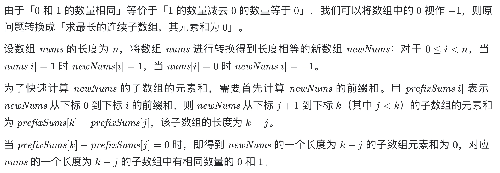
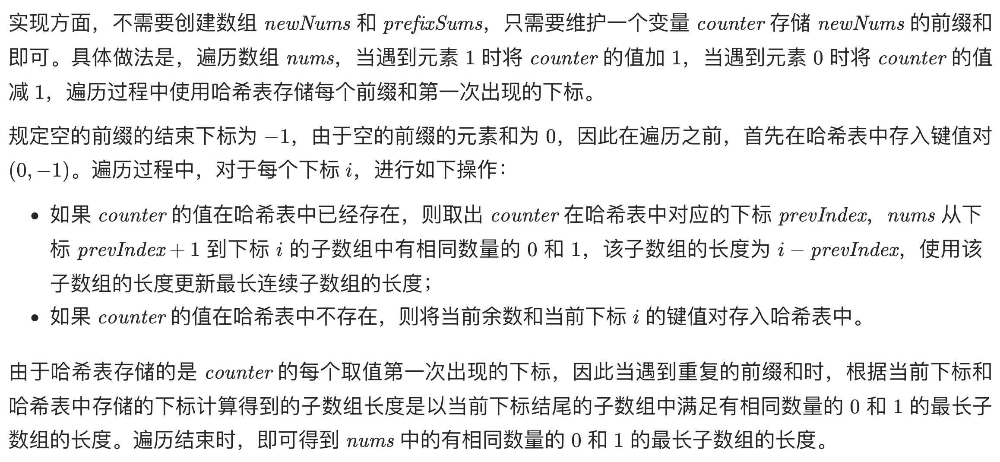

# [525. 连续数组](https://leetcode-cn.com/problems/contiguous-array/)

## 解题思路





## 复杂度分析

**时间复杂度：O(N)**

**空间复杂度：O(N)** 

## 代码实现

```golang
func findMaxLength(nums []int) int {
	var maxLength int
	mp := map[int]int{0: -1} // 哈希表存储每个前缀和上一次出现的下标
	count := 0
	for i := 0; i < len(nums); i++ {
		if nums[i] == 1 { // 计算前缀和
			count++
		} else {
			count--
		}
		if prevIndex, ok := mp[count]; ok {
			// 若count在哈希表中，则说明从上一次的位置到i的count加一减一操作相互抵消
			// nums[prevIndex+1:i+1]中的0与1的数量相同
			maxLength = max(maxLength, i-prevIndex) // 更新结果
		} else {
			mp[count] = i // 更新或记录前缀和出现的下标
		}
	}
	return maxLength
}

func max(a, b int) int {
	if a > b {
		return a
	}
	return b
}
```