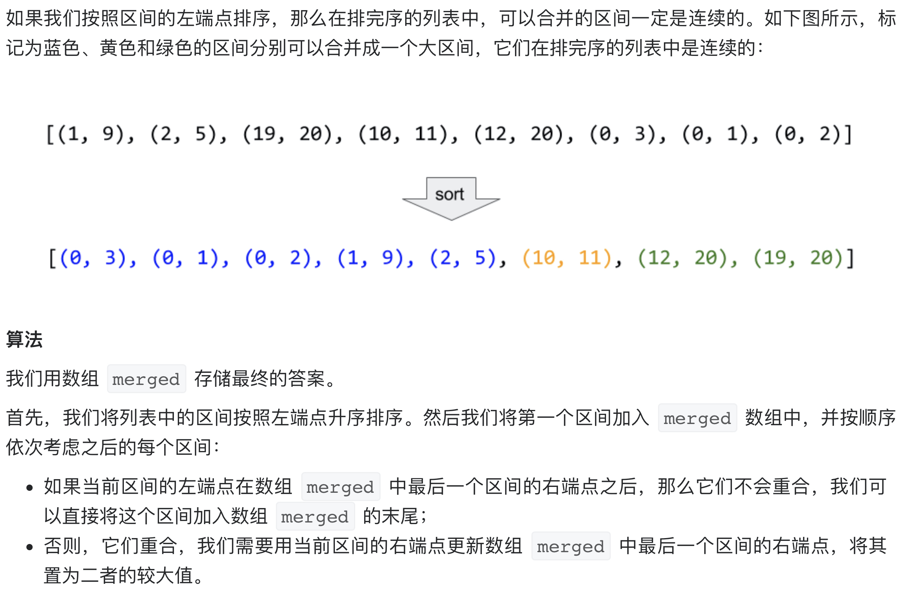

# [56. 合并区间](https://leetcode-cn.com/problems/merge-intervals/)

## 解题思路




## 复杂度分析

**时间复杂度：O(NlogN)**

**空间复杂度：O(logN)** 

## 代码实现

```golang
func merge(intervals [][]int) [][]int {
	var merged [][]int
	sort.Slice(intervals, func(i, j int) bool { // 先根据区间起始点排序
		return intervals[i][0] < intervals[j][0]
	})
	for i := 0; i < len(intervals); i++ {
		if len(merged) == 0 || merged[len(merged)-1][1] < intervals[i][0] { // 为空 或 与上一个区间不重叠时
			merged = append(merged, intervals[i])
		} else { // 若重叠，则合并，更新区间终点
			merged[len(merged)-1][1] = max(merged[len(merged)-1][1], intervals[i][1])
		}
	}
	return merged
}

func max(a, b int) int {
	if a > b {
		return a
	}
	return b
}
```