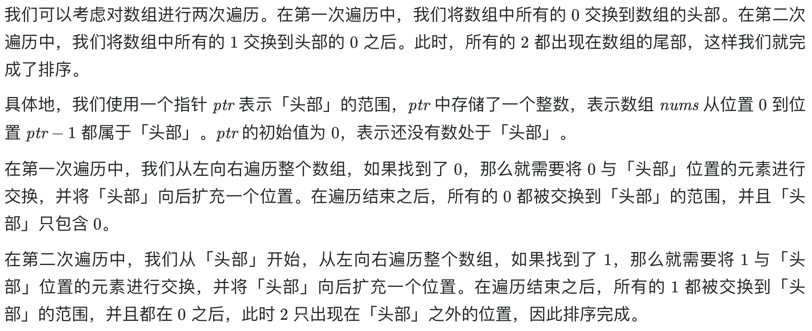
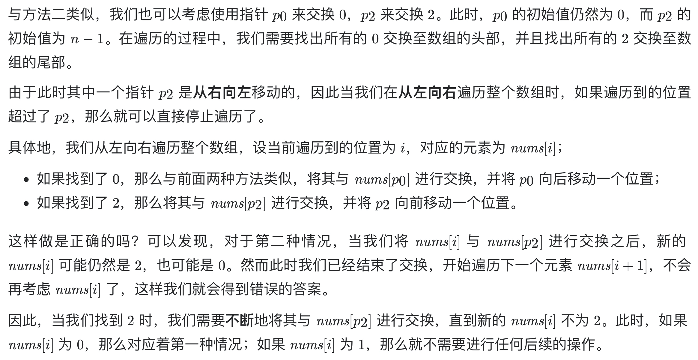

# [75. 颜色分类](https://leetcode-cn.com/problems/sort-colors/)

## 方法一：单指针（推荐）

## 解题思路

本题是经典的「荷兰国旗问题」，由计算机科学家 [Edsger W. Dijkstra](https://baike.baidu.com/item/艾兹格·迪科斯彻) 首先提出。



## 复杂度分析

**时间复杂度：O(N)**

**空间复杂度：O(1)** 

## 代码实现

```golang
func sortColors(nums []int) {
	n, p := len(nums), 0
	for i := 0; i < n; i++ {
		if nums[i] == 0 {
			nums[i], nums[p] = nums[p], nums[i]
			p++
		}
	}
	for i := 0; i < n; i++ {
		if nums[i] == 1 {
			nums[i], nums[p] = nums[p], nums[i]
			p++
		}
	}
}
```

## 方法二：双指针

## 解题思路



## 复杂度分析

**时间复杂度：O(N)**

**空间复杂度：O(1)** 

## 代码实现

```golang
func sortColors(nums []int) {
	p0, p2 := 0, len(nums)-1
	for i := 0; i <= p2; i++ {
		for ; i <= p2 && nums[i] == 2; p2-- { // 注意跳过末尾多个连续2的情况
			nums[i], nums[p2] = nums[p2], nums[i]
		}
		if nums[i] == 0 {
			nums[i], nums[p0] = nums[p0], nums[i]
			p0++
		}
	}
}
```

