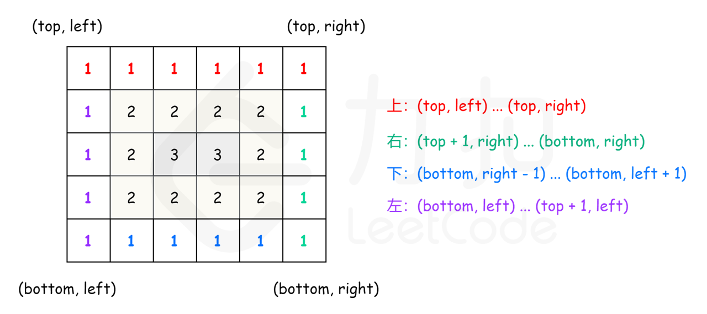

# [剑指 Offer 29. 顺时针打印矩阵](https://leetcode-cn.com/problems/shun-shi-zhen-da-yin-ju-zhen-lcof/)

## 方法一：模拟+标记

## 解题思路

直接按照题目描述模拟输出，需要申请额外数组标记已经访问过的数组元素。

## 复杂度分析

**时间复杂度：O(MN)**

**空间复杂度：O(MN)** 

## 代码实现

```golang
func spiralOrder(matrix [][]int) []int {
	if len(matrix) == 0 || len(matrix[0]) == 0 { // 特判
		return []int{}
	}
	rows, columns := len(matrix), len(matrix[0])
	visited := make([][]bool, rows) // 标记访问过的数组元素
	for i := 0; i < rows; i++ {
		visited[i] = make([]bool, columns)
	}
	total := rows * columns
	order := make([]int, total)
	row, column := 0, 0
	dirs := [][]int{{0, 1}, {1, 0}, {0, -1}, {-1, 0}} // 方向数组
	dirIndex := 0
	for i := 0; i < total; i++ {
		order[i] = matrix[row][column]
		visited[row][column] = true // 标记
		nextRow, nextColumn := row+dirs[dirIndex][0], column+dirs[dirIndex][1]
		if nextRow < 0 || nextRow >= rows || nextColumn < 0 || nextColumn >= columns || visited[nextRow][nextColumn] {
			dirIndex = (dirIndex + 1) % 4
		}
		// 此处，即使前面换了方向，也不会导致row,column越界，否则就无解了
		row += dirs[dirIndex][0]
		column += dirs[dirIndex][1]
	}
	return order
}
```

## 方法二：分层模拟

## 解题思路

**可以将矩阵看成若干层，首先打印最外层的元素，其次打印次外层的元素，直到打印最内层的元素**。定义矩阵的第 k 层是到最近边界距离为 k 的所有顶点。例如，下图矩阵最外层元素都是第 1 层，次外层元素都是第 2 层，剩下的元素都是第 3 层。

```go
[[1, 1, 1, 1, 1, 1, 1],
 [1, 2, 2, 2, 2, 2, 1],
 [1, 2, 3, 3, 3, 2, 1],
 [1, 2, 2, 2, 2, 2, 1],
 [1, 1, 1, 1, 1, 1, 1]]
```

对于每层，从左上方开始以顺时针的顺序遍历所有元素。假设当前层的左上角位于 (top, left)，右下角位于 
(bottom, right)，按照如下顺序遍历当前层的元素。

1、从左到右遍历上侧元素，依次为 (top, left) 到 (top, right)；
2、从上到下遍历右侧元素，依次为 (top+1, right) 到 (bottom, right)；
3、**如果 left<right 且 top<bottom**，则从右到左遍历下侧元素，依次为 (bottom, right−1) 到 (bottom, left+1)，以及从下到上遍历左侧元素，依次为 (bottom, left) 到 (top+1, left)。



遍历完当前层的元素之后，将 left 和 top 分别增加 1，将 right 和 bottom 分别减少 1，进入下一层继续遍历，直到遍历完所有元素为止。

## 复杂度分析

**时间复杂度：O(MN)**

**空间复杂度：O(1)** 

## 代码实现

```golang
func spiralOrder(matrix [][]int) []int {
	if len(matrix) == 0 || len(matrix[0]) == 0 { // 特判
		return []int{}
	}
	rows, columns := len(matrix), len(matrix[0])
	order := make([]int, rows*columns)
	index := 0
	left, right, top, bottom := 0, columns-1, 0, rows-1
	for left <= right && top <= bottom { // 终止条件
		for column := left; column <= right; column++ {
			order[index] = matrix[top][column]
			index++
		}
		for row := top + 1; row <= bottom; row++ {
			order[index] = matrix[row][right]
			index++
		}
		// 当 left==right 或 top==bottom 时，说明只有一行或一列
		// 表示已经是最内层，由于顺时针访问，最内层行应该从左向右，列应该从上到下
		// 所以需要判断下，防止访问顺序反了
		if left < right && top < bottom { // 注意条件
			for column := right - 1; column > left; column-- {
				order[index] = matrix[bottom][column]
				index++
			}
			for row := bottom; row > top; row-- {
				order[index] = matrix[row][left]
				index++
			}
		}
		left++
		right--
		top++
		bottom--
	}
	return order
}
```

