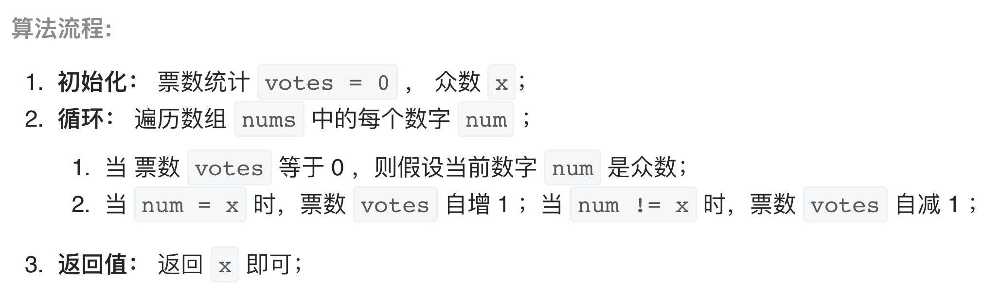

# [剑指 Offer 39. 数组中出现次数超过一半的数字](https://leetcode-cn.com/problems/shu-zu-zhong-chu-xian-ci-shu-chao-guo-yi-ban-de-shu-zi-lcof/)

## 解题思路

本文将 “数组中出现次数超过一半的数字” 简称为 **“众数”** 。需要注意的是，数学中众数的定义为 “数组中出现次数最多的数字” ，与本文定义不同。

**摩尔投票法**：设输入数组 nums 的众数为 x ，数组长度为 n。

**推论一**： 若记 **众数** 的票数为 +1 ，**非众数** 的票数为 −1 ，则一定有所有数字的 票数和>0。

**推论二**： 若数组的前 a 个数字的 票数和=0 ，则 数组剩余 (n−a) 个数字的 票数和一定仍 >0 即后 (n−a) 个数字的 众数仍为 x。


根据以上推论，记数组首个元素为 n1，众数为 x ，遍历并统计票数。当发生 票数和=0 时，剩余数组的众数一定不变 ，这是由于：

当 n1=x ： 抵消的所有数字，有一半是众数 x 。
当 n1!=x ： 抵消的所有数字，众数 x 的数量为一半或 0 个。
利用此特性，每轮假设发生 票数和 =0 都可以 缩小剩余数组区间 。当遍历完成时，最后一轮假设的数字即为众数。



## 复杂度分析

**时间复杂度：O(N)**

**空间复杂度：O(1)** 

## 代码实现

```golang
func majorityElement(nums []int) int {
	var x int
  votes := 0
	for i := 0; i < len(nums); i++ {
		if votes == 0 { // 每当票数为 0 时表示众数被抵消了，初始化新众数
			x = nums[i]
		}
		if nums[i] == x { // 众数，投票+1
			votes++
		} else { // 非众数，投票-1
			votes--
		}
	}
	return x
}
```

## 问题延伸

由于题目说明 **给定的数组总是存在多数元素** ，因此本题不用考虑 **数组不存在众数** 的情况。若考虑，需要加入一个 “验证环节” ，遍历数组 nums 统计 x 的数量。

- 若 `x` 的数量超过数组长度一半，则返回 `x` ；
- 否则，返回未找到众数；

## 代码实现

```golang
func majorityElement(nums []int) int {
	var x int
	votes := 0
	count := 0
	for i := 0; i < len(nums); i++ {
		if votes == 0 { // 每当票数为 0 时表示众数被抵消了，初始化新众数
			x = nums[i]
		}
		if nums[i] == x { // 众数，投票+1
			votes++
		} else { // 非众数，投票-1
			votes--
		}
	}
	for i := 0; i < len(nums); i++ {
		if nums[i] == x {
			count++
		}
	}
	if count <= len(nums)/2 { // 当无众数时返回 0
		return 0
	}
	return x
}
```

