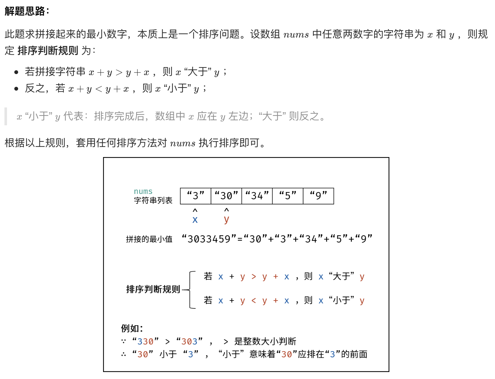

# [剑指 Offer 45. 把数组排成最小的数](https://leetcode-cn.com/problems/ba-shu-zu-pai-cheng-zui-xiao-de-shu-lcof/)

## 解题思路



## 复杂度分析

**时间复杂度：O(NlogN)**，N 为最终返回值的字符数量，使用快排或内置函数的平均时间复杂度为 O(NlogN) ，最差为 O(N^2) 。

**空间复杂度：O(N)**，存储拼接的字符串。

## 代码实现（自实现快排）

```golang
func minNumber(nums []int) string {
	quickSort(nums, 0, len(nums))
	res := ""
	for i := 0; i < len(nums); i++ {
		res += strconv.Itoa(nums[i])
	}
	return res
}

func quickSort(nums []int, left, right int) { // 快速排序
	if left < right {
		boundary := partition(nums, left, right)
		quickSort(nums, left, boundary)
		quickSort(nums, boundary+1, right)
	}
}

func partition(nums []int, left, right int) int { // 分区
	start, end := left, right-1
	pivot := nums[end]
	for start < end {
		for start < end && compare(nums[start], pivot) <= 0 {
			start++
		}
		for start < end && compare(nums[end], pivot) >= 0 {
			end--
		}
		if start < end {
			nums[start], nums[end] = nums[end], nums[start]
		}
	}
	if start != right-1 {
		nums[end], nums[right-1] = nums[right-1], nums[end]
	}
	return end
}

func compare(a, b int) int { // 特殊比较方法
	if a == b {
		return 0
	}
	stra := strconv.Itoa(a)
	strb := strconv.Itoa(b)
	if stra+strb > strb+stra {
		return 1
	}
	return -1
}
```

## 代码实现（基于Sort）

```golang
func minNumber(nums []int) string {
    temp := make([]string, len(nums))
	for i, v := range nums {
		temp[i] = strconv.Itoa(v)
	}
	sort.Slice(temp, func (i, j int) bool {
		return temp[i] + temp[j] < temp[j] + temp[i]
	})
    
	result := ""
	for i := 0; i < len(temp); i++ {
		result += temp[i]
	}
	return result
}
```

