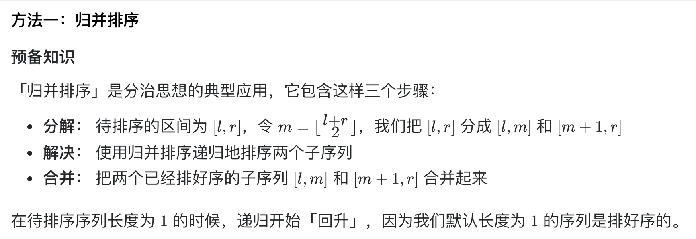
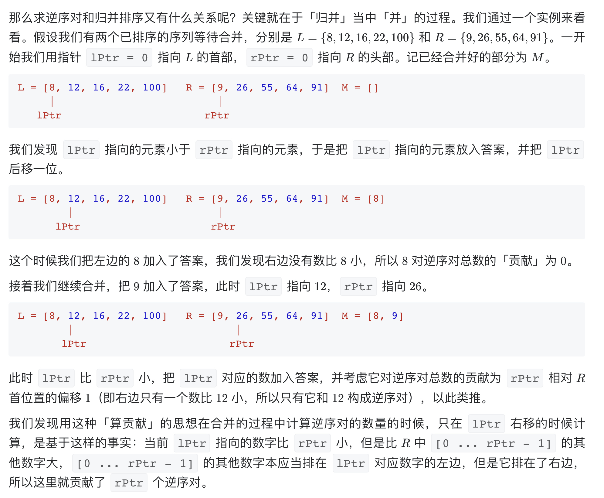

# [剑指 Offer 51. 数组中的逆序对](https://leetcode-cn.com/problems/shu-zu-zhong-de-ni-xu-dui-lcof/)

## 解题思路





## 复杂度分析

**时间复杂度：O(NlogN)**

**空间复杂度：O(N)** 

## 代码实现（未优化，纯递归，好理解）

```golang
type ReversePairs struct {
	num int // 为了共享num，作为全局变量，直接写外面leetcode编辑器会报错
}

func (r *ReversePairs) mergeSort(arr []int) []int {
	// 归并排序算法 递归实现
	if len(arr) < 2 {
		// 递归终止条件
		return arr
	}
	// 将数组平分成2个
	left := arr[:len(arr)/2]
	right := arr[len(arr)/2:]
	// 对平分后的数组递归调用归并算法
	// 并将结果合并merge
	return r.merge(r.mergeSort(left), r.mergeSort(right))
}

func (r *ReversePairs) merge(left, right []int) []int {
	// 合并2个有序数组
	var res []int
	for i, j := 0, 0; ; {
		if i >= len(left) {
			for j < len(right) {
				res = append(res, right[j])
				j++
			}
			return res
		}
		if j >= len(right) {
			for i < len(left) {
				res = append(res, left[i])
				i++
			}
			return res
		}
		if left[i] <= right[j] {
			res = append(res, left[i])
			i++
		} else {
			r.num += len(left) - i // 统计 left 中比 right[j] 大的元素个数
			res = append(res, right[j])
			j++
		}
	}
	return res
}

func reversePairs(nums []int) int {
	r := &ReversePairs{}
	r.mergeSort(nums)
	return r.num
}
```

## 代码实现（优化，原地归并排序）

```golang
func reversePairs(nums []int) int {
	n := len(nums)
	temp := make([]int, n)
	return mergeSort(nums, temp, 0, n-1)
}
func mergeSort(A, temp []int, start, end int) int {
	if start >= end {
		return 0
	}
	mid := start + (end-start)>>1
	count := mergeSort(A, temp, start, mid) + mergeSort(A, temp, mid+1, end)
	i, j, k := start, mid+1, 0
	for ; i <= mid && j <= end; k++ {
		if A[i] > A[j] {
			count += mid - i + 1 // 统计 左边元素 中比 A[j] 大的元素个数
			temp[k] = A[j]
			j++
		} else {
			temp[k] = A[i]
			i++
		}
	}
	for ; i <= mid; i++ {
		temp[k] = A[i]
		k++
	}
	for ; j <= end; j++ {
		temp[k] = A[j]
		k++
	}
	copy(A[start:end+1], temp) // 临时切片中的元素拷贝回原始切片中，避免频繁申请空间
	return count
}
```

