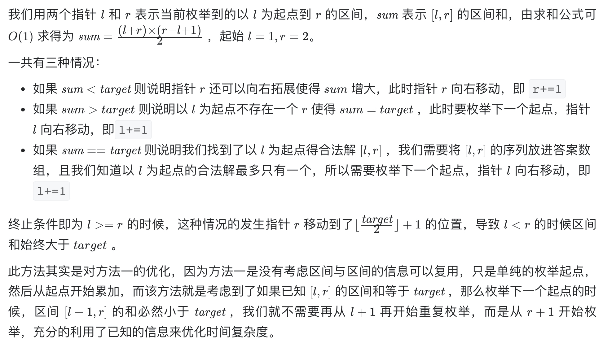

# [剑指 Offer 57 - II. 和为s的连续正数序列](https://leetcode-cn.com/problems/he-wei-sde-lian-xu-zheng-shu-xu-lie-lcof/)

## 解题思路

本题基于双指针思想。



## 复杂度分析

**时间复杂度：O(N)**，N 为 target，最多遍历 target/2 轮。

**空间复杂度：O(1)** 

## 代码实现

```golang
func findContinuousSequence(target int) [][]int {
	res := make([][]int, 0)
	for i, j := 1, 2; i < j; { // 最多遍历到j=target/2+1
		sum := (i + j) * (j - i + 1) / 2 // 求和公式
		if sum == target {
			tmp := make([]int, 0)
			for k := i; k <= j; k++ {
				tmp = append(tmp, k)
			}
			res = append(res, tmp) // 记录结果
			j++
		} else if sum > target {
			i++
		} else {
			j++
		}
	}
	return res
}
```