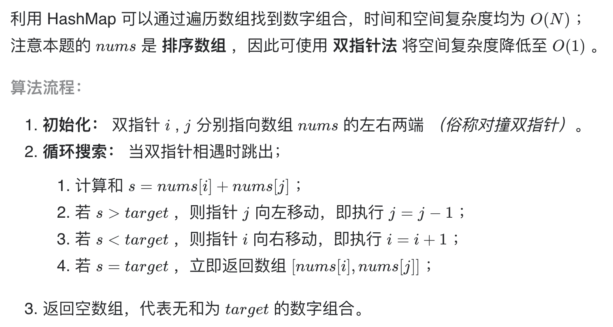

# [剑指 Offer 57. 和为s的两个数字](https://leetcode-cn.com/problems/he-wei-sde-liang-ge-shu-zi-lcof/)

## 解题思路



## 复杂度分析

**时间复杂度：O(N)**

**空间复杂度：O(1)** 

## 代码实现

```golang
func twoSum(nums []int, target int) []int {
	l, r := 0, len(nums)-1
	for l < r {
		if nums[l]+nums[r] == target {
			return []int{nums[l], nums[r]}
		} else if nums[l]+nums[r] > target {
			r--
		} else {
			l++
		}
	}
	return []int{}
}
```

## 相关题目

[15. 三数之和](https://github.com/WTongStudio/LeetCode/blob/master/数据结构/数组/15.%20三数之和.md)