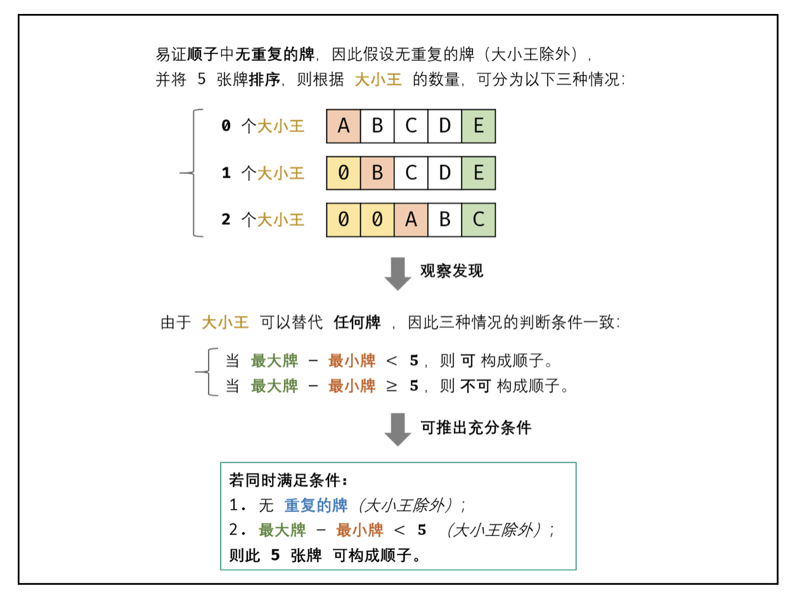

# [剑指 Offer 61. 扑克牌中的顺子](https://leetcode-cn.com/problems/bu-ke-pai-zhong-de-shun-zi-lcof/)

## 方法一：集合/哈希表+遍历

## 解题思路





## 复杂度分析

**时间复杂度：O(N)**

**空间复杂度：O(N)** 

## 代码实现

```golang
func isStraight(nums []int) bool {
	repeat := make(map[int]bool)
	min, max := 14, 0
	for i := 0; i < len(nums); i++ {
		if nums[i] == 0 { // 跳过大小王
			continue
		}
		if nums[i] < min {
			min = nums[i]
		}
		if nums[i] > max {
			max = nums[i]
		}
		if repeat[nums[i]] { // 若重复
			return false
		}
		repeat[nums[i]] = true
	}
	return max-min < 5 // 最大牌 - 最小牌 < 5 则可构成顺子
}
```

## 方法二：排序+遍历

## 解题思路


## 复杂度分析

**时间复杂度：O(NlogN)**

**空间复杂度：O(1)** 

## 代码实现

```golang
func isStraight(nums []int) bool {
	joker := 0 // 大小王的数量
	sort.Ints(nums)
	for i := 0; i < 4; i++ {
		if nums[i] == 0 {
			joker++ // 统计大小王数量
		} else if nums[i] == nums[i+1] { // 若重复，返回false
			return false
		}
	}
	return nums[4]-nums[joker] < 5 // 最大牌 - 最小牌 < 5 则可构成顺子
}
```

