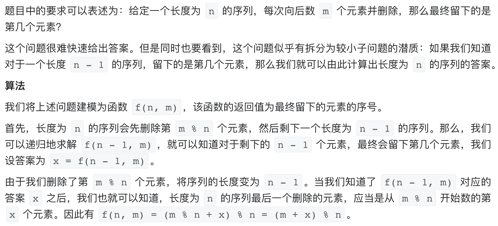

# [剑指 Offer 62. 圆圈中最后剩下的数字](https://leetcode-cn.com/problems/yuan-quan-zhong-zui-hou-sheng-xia-de-shu-zi-lcof/)

## 解题思路

本题可以通过模拟实现，但效率较低，解法略。本题最优解是通过数学+递推方式实现。



我们递归计算 f(n, m), f(n - 1, m), f(n - 2, m), ... 直到递归的终点 f(1, m)。当序列长度为 1 时，一定会留下唯一的那个元素，编号为 0。

## 复杂度分析

**时间复杂度：O(N)**

**空间复杂度：O(N)** 

## 代码实现（递归）

```golang
func lastRemaining(n int, m int) int {
	if n == 1 {
		return 0
	}
	x := lastRemaining(n-1, m)
	return (m + x) % n
}
```

## 代码实现（递推，推荐）

```golang
func lastRemaining(n int, m int) int {
	f := 0
	for i := 2; i <= n; i++ { // 递推计算f(2,m),f(3,m),...f(n,m)
		f = (m + f) % i
	}
	return f
}
```

