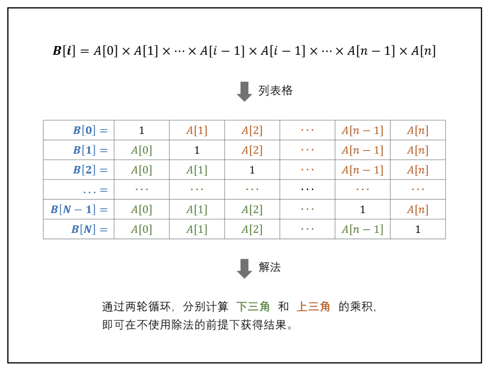
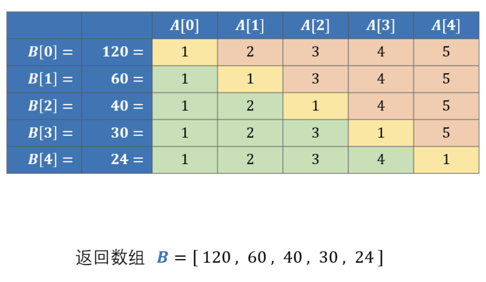
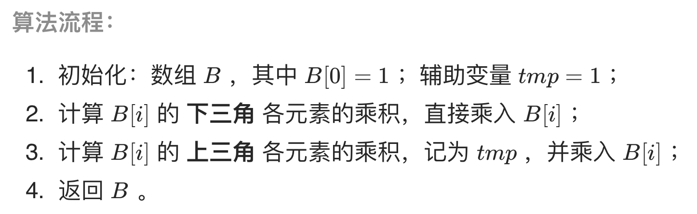

# [剑指 Offer 66. 构建乘积数组](https://leetcode-cn.com/problems/gou-jian-cheng-ji-shu-zu-lcof/)

## 解题思路

本题的难点在于 **不能使用除法** ，即需要只用乘法生成数组 B 。根据题目对 B[i] 的定义，可列表格，如下图所示。



根据表格的主对角线（全为 1），可将表格分为 **上三角** 和 **下三角** 两部分。分别迭代计算下三角和上三角两部分的乘积，即可不使用除法就获得结果。





## 复杂度分析

**时间复杂度：O(N)**

**空间复杂度：O(1)** 

## 代码实现

```golang
func constructArr(a []int) []int {
	n := len(a)
	b := make([]int, n)
	for i := range b {
		b[i] = 1
	}
	tmp := 1
	for i := 1; i < n; i++ {
		b[i] = b[i-1] * a[i-1] // 下三角
	}
	for i := n - 2; i >= 0; i-- { // 从倒数第二开始倒序遍历
		tmp *= a[i+1] // 上三角
		b[i] *= tmp   // 下三角*上三角
	}
	return b
}
```