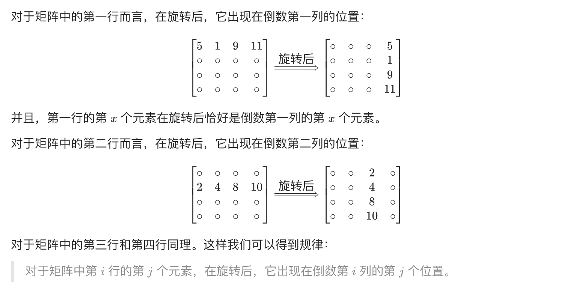
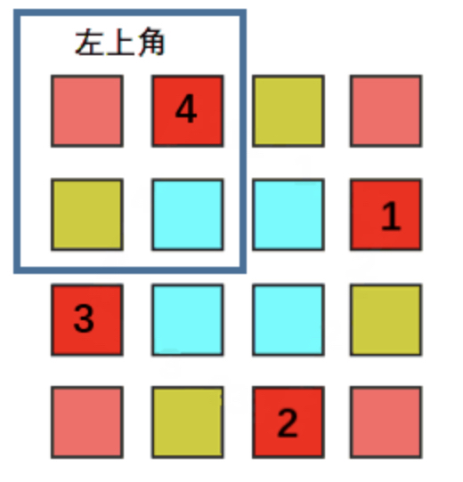
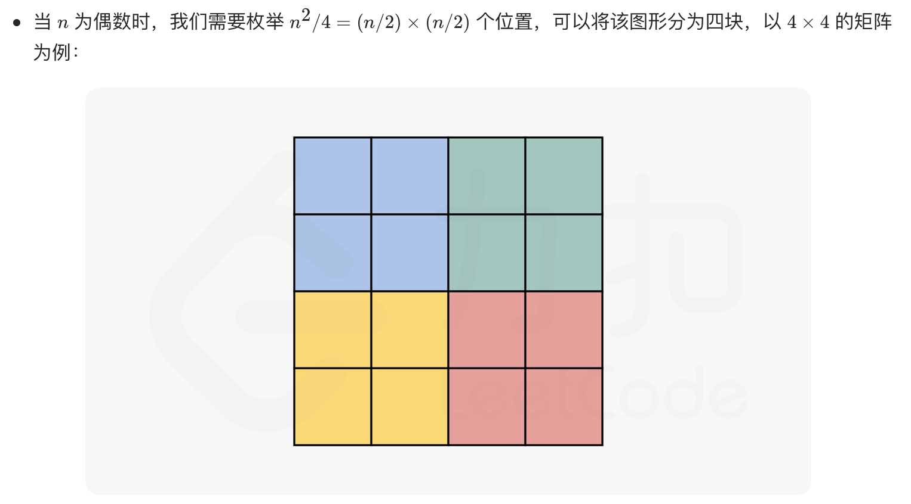
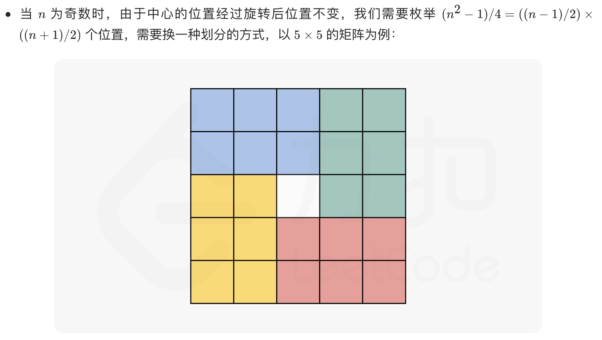
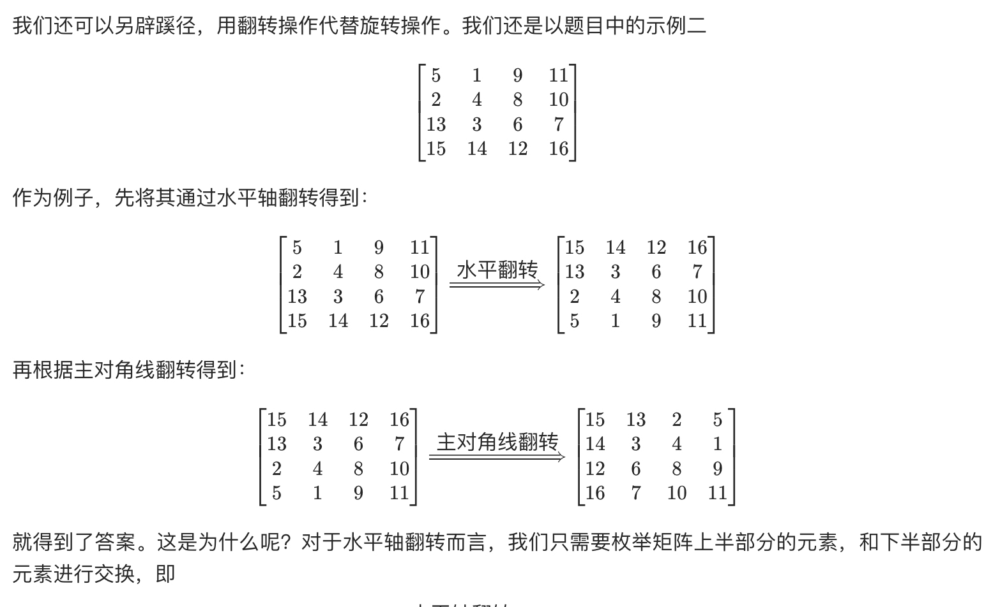

# [面试题 01.07. 旋转矩阵](https://leetcode-cn.com/problems/rotate-matrix-lcci/)

## 方法一：辅助数组

## 解题思路



## 复杂度分析

**时间复杂度：O(N^2)**

**空间复杂度：O(N^2)** 

## 代码实现

```golang
func rotate(matrix [][]int) {
	n := len(matrix)
	res := make([][]int, n)
	for i := range res {
		res[i] = make([]int, n)
	}
	for i := 0; i < n; i++ {
		for j := 0; j < n; j++ {
			res[j][n-i-1] = matrix[i][j]
		}
	}
	copy(matrix, res) // 注意此处需要深拷贝，将数据拷贝至原始的底层数组中
}
```

## 方法二：原地旋转

将矩阵水平垂直分成 4 块，分别瞬时针移动这 4 块数据内容，但需注意分奇偶情况。







## 解题思路

## 复杂度分析

**时间复杂度：O(N^2)**

**空间复杂度：O(1)** 

## 代码实现

```go
func rotate(matrix [][]int) {
	n := len(matrix)
	for i := 0; i < n/2; i++ { // 行数向下取整
		for j := 0; j < (n+1)/2; j++ { // 列数向上取整
			// 交换对应的四个值，注意此处不能分开写，要一条语句同时处理，避免了申请变量记录
			matrix[i][j], matrix[n-j-1][i], matrix[n-i-1][n-j-1], matrix[j][n-i-1] =
				matrix[n-j-1][i], matrix[n-i-1][n-j-1], matrix[j][n-i-1], matrix[i][j]
		}
	}
}
```

## 方法三：翻转代替旋转

## 解题思路

瞬时间旋转 = 水平线翻转 + 主对角线翻转



## 复杂度分析

**时间复杂度：O(N^2)**，O(N)+O(N^2)=O(N)。

**空间复杂度：O(1)** 

## 代码实现

```go
func rotate(matrix [][]int) {
	n := len(matrix)
	// 水平线翻转
	for i := 0; i < n/2; i++ {
		matrix[i], matrix[n-1-i] = matrix[n-1-i], matrix[i]
	}
	// 主对角线翻转
	for i := 0; i < n; i++ {
		for j := 0; j < i; j++ { // 遍历下三角
			matrix[i][j], matrix[j][i] = matrix[j][i], matrix[i][j]
		}
	}
}
```

