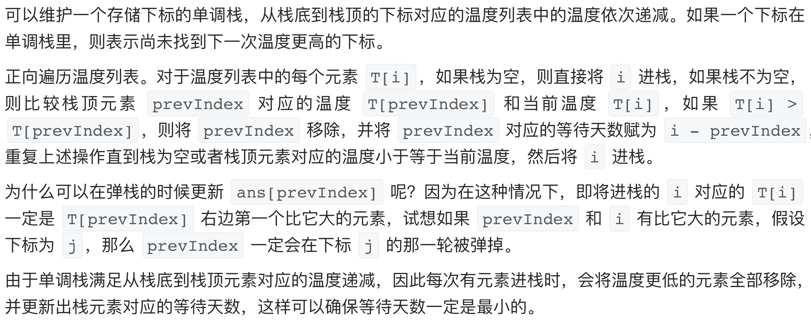

# [739. 每日温度](https://leetcode-cn.com/problems/daily-temperatures/)

## 解题思路



## 复杂度分析

**时间复杂度：O(N)**

**空间复杂度：O(N)** 

## 代码实现

```golang
func dailyTemperatures(T []int) []int {
	n := len(T)
	ans := make([]int, n)
	stack := make([]int, 0) // 存放的是下标
	for i := 0; i < n; i++ {
		for len(stack) > 0 && T[i] > T[stack[len(stack)-1]] { // 单调栈
			prevIndex := stack[len(stack)-1]
			stack = stack[:len(stack)-1]
			ans[prevIndex] = i - prevIndex
		}
		stack = append(stack, i)
	}
	return ans
}
```