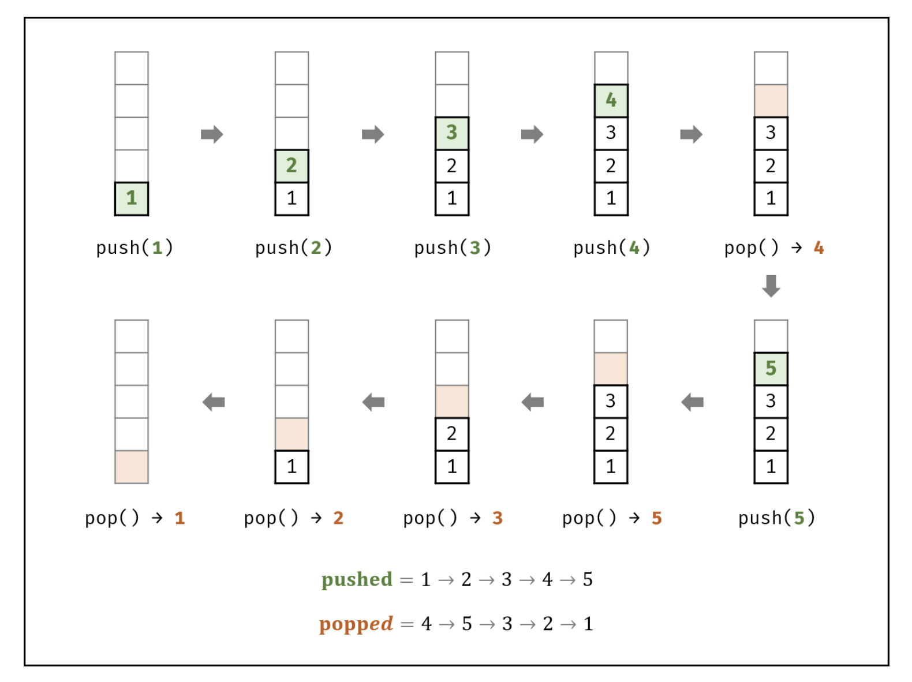
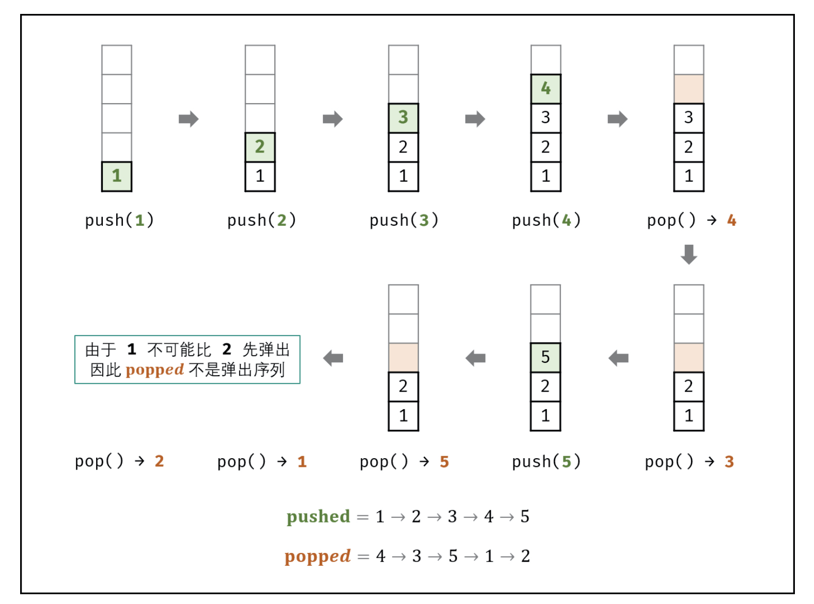

# [剑指 Offer 31. 栈的压入、弹出序列](https://leetcode-cn.com/problems/zhan-de-ya-ru-dan-chu-xu-lie-lcof/)

## 解题思路

如下图所示，给定一个压入序列 pushed 和弹出序列 popped ，则压入 / 弹出操作的顺序（即排列）是 **唯一确定** 的。



如下图所示，栈的数据操作具有 **先入后出** 的特性，因此某些弹出序列是无法实现的。



**考虑借用一个辅助栈 stack ，模拟 压入/弹出 操作的排列**。根据是否模拟成功，即可得到结果。

**入栈操作**： 按照压栈序列的顺序执行。
**出栈操作**： 每次入栈后，循环判断 **“栈顶元素 = 弹出序列的当前元素”** 是否成立，将符合弹出序列顺序的栈顶元素全部弹出。

由于题目规定 **栈的所有数字均不相等** ，因此在循环入栈中，每个元素出栈的位置的可能性是唯一的（若有重复数字，则具有多个可出栈的位置）。因而，在遇到 “栈顶元素 = 弹出序列的当前元素” 就应立即执行出栈。

题目指出 pushed 是 popped 的排列 。因此，无需考虑 pushed 和 popped 长度不同 或 包含元素不同 的情况。

## 复杂度分析

**时间复杂度：O(N)**，其中 N 为列表 pushed 的长度，**每个元素最多入栈与出栈一次**，即最多共 2N 次出入栈操作。

**空间复杂度：O(N)**， 辅助栈 stack 最多同时存储 N 个元素。

## 代码实现

```golang
func validateStackSequences(pushed []int, popped []int) bool {
	stack := list.New()
	j := 0 // 出栈队列指针
	for i := 0; i < len(pushed); i++ {
		stack.PushBack(pushed[i])
		for stack.Len() > 0 && stack.Back().Value.(int) == popped[j] {
			stack.Remove(stack.Back())
			j++
		}
	}
	// 最终的判断条件是：模拟栈是否为空
	// 若模拟栈为空表示全部入栈元素最终都出栈了
	// 由于入栈与出栈次数是相同的，所以出栈序列也应该同时遍历完毕
	return stack.Len() == 0
}
```