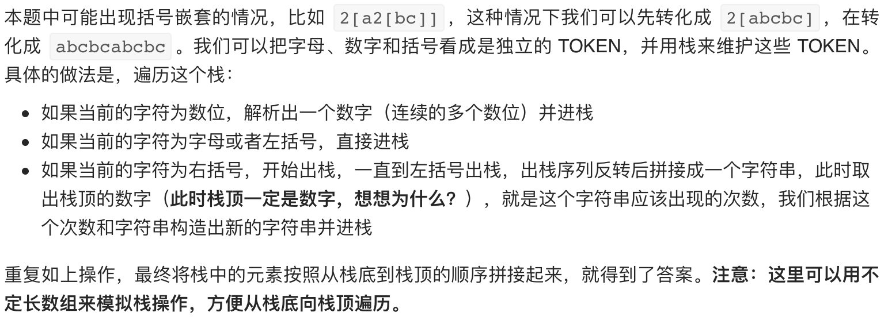

# [394. 字符串解码](https://leetcode-cn.com/problems/decode-string/)

## 解题思路



## 复杂度分析

**时间复杂度：O(S)**，记解码后得出的字符串长度为 S，除了遍历一次原字符串 s，我们还需要将解码后的字符串中的每个字符都入栈，并最终拼接进答案中，故渐进时间复杂度为 O(S+∣s∣)，即 O(S)。

**空间复杂度：O(S)**，记解码后得出的字符串长度为 S，这里用栈维护 TOKEN，栈的总大小最终与 S 相同，故渐进空间复杂度为 O(S)。 

## 代码实现

```golang
func decodeString(s string) string {
	stack := make([]string, 0)
	ptr := 0
	for ptr < len(s) {
		cur := s[ptr]
		if cur >= '0' && cur <= '9' { // 若为数字，则需解析出数字
			digits := getDigits(s, &ptr)
			stack = append(stack, digits)
		} else if (cur >= 'a' && cur <= 'z' || cur >= 'A' && cur <= 'Z') || cur == '[' {
			stack = append(stack, string(cur))
			ptr++
		} else {
			ptr++
			sub := make([]string, 0)
			for stack[len(stack)-1] != "[" {
				sub = append(sub, stack[len(stack)-1])
				stack = stack[:len(stack)-1]
			}
			for i := 0; i < len(sub)/2; i++ {
				sub[i], sub[len(sub)-i-1] = sub[len(sub)-i-1], sub[i]
			}
			stack = stack[:len(stack)-1]
			repTime, _ := strconv.Atoi(stack[len(stack)-1])
			stack = stack[:len(stack)-1]
			t := strings.Repeat(getString(sub), repTime)
			stack = append(stack, t)
		}
	}
	return getString(stack)
}
```