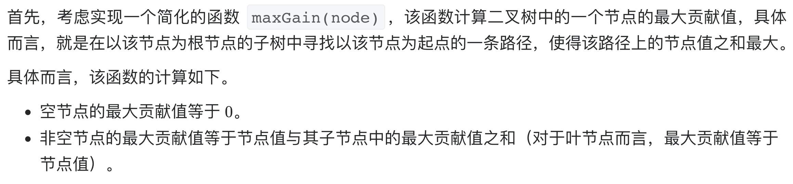
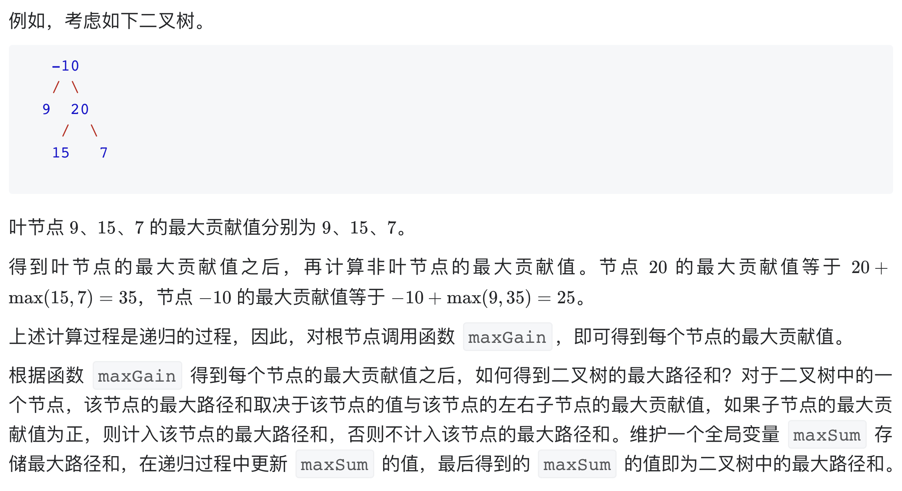

# [124. 二叉树中的最大路径和](https://leetcode-cn.com/problems/binary-tree-maximum-path-sum/)

## 解题思路





## 复杂度分析

**时间复杂度：O(N)**

**空间复杂度：O(N)** 

## 代码实现

```golang
func maxPathSum(root *TreeNode) int {
	maxSum := math.MinInt32
	var maxGain func(*TreeNode) int
	maxGain = func(node *TreeNode) int {
		if node == nil {
			return 0
		}
		// 递归计算左右子节点的最大贡献值
		// 只有在最大贡献值大于 0 时，才会选取对应子节点
		leftGain := max(maxGain(node.Left), 0)
		rightGain := max(maxGain(node.Right), 0)

		// 节点的最大路径和取决于该节点的值与该节点的左右子节点的最大贡献值
		priceNewPath := node.Val + leftGain + rightGain

		// 更新答案
		maxSum = max(maxSum, priceNewPath)

		// 返回节点的最大贡献值
		return node.Val + max(leftGain, rightGain)
	}
	maxGain(root)
	return maxSum
}

func max(x, y int) int {
	if x > y {
		return x
	}
	return y
}
```

## 相关题目

[面试题 04.12. 求和路径](https://github.com/WTongStudio/LeetCode/blob/master/数据结构/树/面试题%2004.12.%20求和路径.md)

[剑指 Offer 34. 二叉树中和为某一值的路径](https://github.com/WTongStudio/LeetCode/blob/master/数据结构/树/剑指%20Offer%2034.%20二叉树中和为某一值的路径.md)