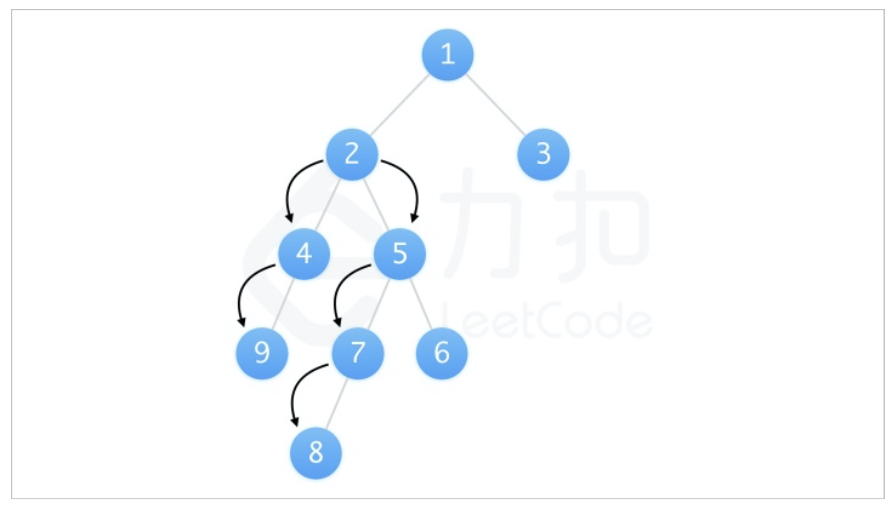
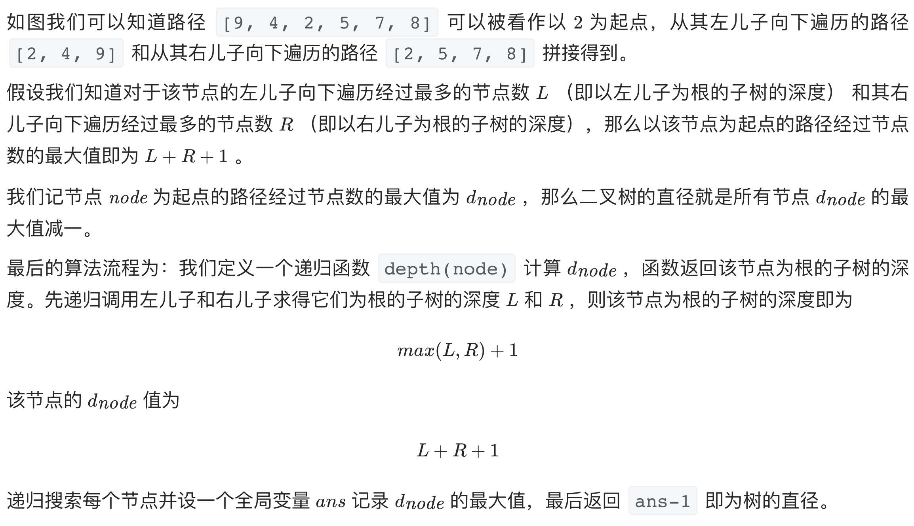

# [543. 二叉树的直径](https://leetcode-cn.com/problems/diameter-of-binary-tree/)

## 解题思路

本题与 [124. 二叉树中的最大路径和](https://github.com/WTongStudio/LeetCode/blob/master/数据结构/树/124.%20二叉树中的最大路径和.md) 类似，但完全不一样，前者求的是路径节点值和的最大值，而本题求的是路径长度的最大值。

首先我们知道一条路径的长度为该路径经过的节点数减一，所以求直径（即求路径长度的最大值）等效于求路径经过节点数的最大值减一。而任意一条路径均可以被看作由某个节点为起点，从其左儿子和右儿子向下遍历的路径拼接得到。





## 复杂度分析

**时间复杂度：O(N)**

**空间复杂度：O(N)** 

## 代码实现

```golang
func diameterOfBinaryTree(root *TreeNode) int {
	maxNodes := 0
	var depth func(root *TreeNode) int
	depth = func(root *TreeNode) int {
		if root == nil {
			return 0
		}
		left := depth(root.Left)   // 左儿子为根的子树的深度
		right := depth(root.Right) // 右儿子为根的子树的深度
		maxNodes = max(maxNodes, left+right+1)
		return max(left, right) + 1 // 返回该节点为根的子树的深度
	}
	depth(root)
	return maxNodes - 1 // 最长路径为最长节点减一
}
func max(a, b int) int {
	if a > b {
		return a
	}
	return b
}
```

## 相关题目

[124. 二叉树中的最大路径和](https://github.com/WTongStudio/LeetCode/blob/master/数据结构/树/124.%20二叉树中的最大路径和.md)