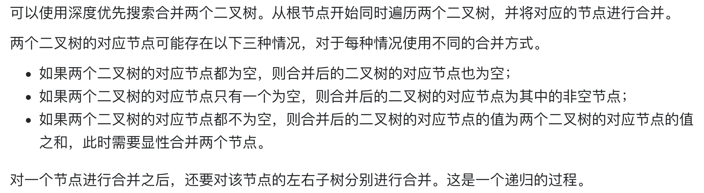

# [617. 合并二叉树](https://leetcode-cn.com/problems/merge-two-binary-trees/)

## 解题思路



## 复杂度分析

**时间复杂度：O(min(N,M))**，其中 M 和 N 分别是两个二叉树的节点个数。对两个二叉树同时进行深度优先搜索，只有当两个二叉树中的对应节点都不为空时才会对该节点进行显性合并操作，因此被访问到的节点数不会超过较小的二叉树的节点数。

**空间复杂度：O(min(N,M))**，其中 M 和 N 分别是两个二叉树的节点个数。空间复杂度取决于递归调用的层数，递归调用的层数不会超过较小的二叉树的最大高度，最坏情况下，二叉树的高度等于节点数。

## 代码实现

```golang
func mergeTrees(t1, t2 *TreeNode) *TreeNode {
	if t1 == nil { // 若 t1 为空，则其子树也均为空，终止遍历，直接返回 t2
		return t2
	}
	if t2 == nil { // 若 t2 为空，则其子树也均为空，终止遍历，直接返回 t1
		return t1
	}
	t1.Val += t2.Val
	t1.Left = mergeTrees(t1.Left, t2.Left)
	t1.Right = mergeTrees(t1.Right, t2.Right)
	return t1
}
```