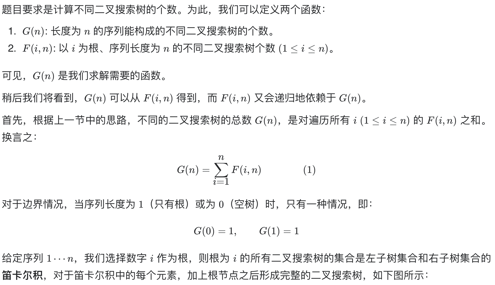
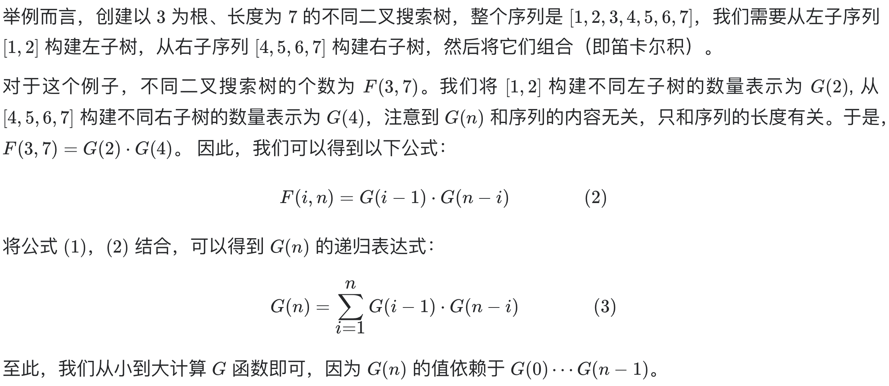

# [**215. 数组中的第K个最大元素**](https://leetcode-cn.com/problems/kth-largest-element-in-an-array/)

## 方法一：动态规划

## 解题思路







**注意：直接递归会超时，因为重复计算了，所以需要动态规划。**

## 复杂度分析

**时间复杂度：O(N^2)**

**空间复杂度：O(N)** 

## 代码实现

```golang
func numTrees(n int) int {
	G := make([]int, n+1) // G[i] 表示长度为i的二叉搜索树数量
	G[0], G[1] = 1, 1
	for i := 2; i <= n; i++ {
		for j := 0; j < i; j++ { // 注意累计求和的上限
			G[i] += G[j] * G[i-j-1]
		}
	}
	return G[n]
}
```

## 方法二：数学

## 解题思路


## 复杂度分析

**时间复杂度：O(N)**

**空间复杂度：O(1)** 

## 代码实现

```go
func numTrees(n int) int {
    C := 1
    for i := 0; i < n; i++ {
        C = C * 2 * (2 * i + 1) / (i + 2);
    }
    return C
}
```

