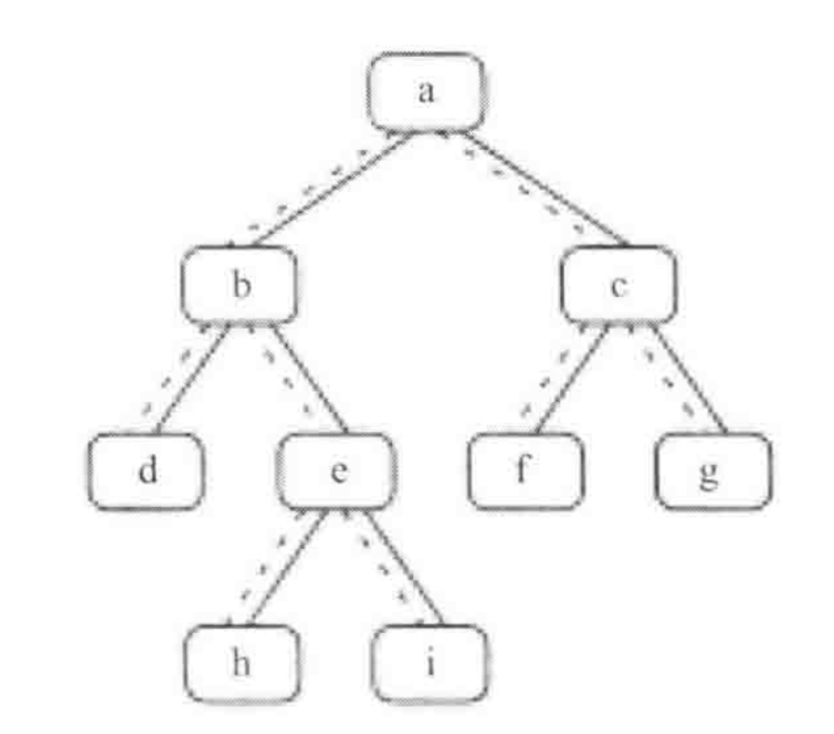

# 剑指 Offer 08. 二叉树的下一个节点

## 题目描述

给定一个二叉树和其中的一个结点，请找出中序遍历顺序的下一个结点并且返回。注意，树中的结点不仅包含左右子结点，同时包含指向父结点的指针。

## 解题思路



根据中序遍历的特点，要找到一个节点的下一个节点无非就是三种情况：

1. **当前节点有右子树**：这时只需要把其右孩子作为下一个遍历的（**并不是要找的**）节点，然后沿着该节点的左子树（如果有的话）出发，直到遇到叶子节点，那么该叶子节点就是其下一个要找的节点；
2. **当前节点无右子树，且其是父节点的左孩子**：则要找的下一个节点就是其父节点；
3. **当前节点无右子树，且其是父节点的右孩子**：则把其父节点作为下一个遍历的节点，向上回溯，直到找到一个 是它父节点的左子节点的节点 。 如果这样的节点存在，那么这个节点的父节点就是我们要找的下一个节点；

综合这三种情况就可以找到二叉树中任意一个节点的下一个节点。

## 复杂度分析

**时间复杂度：O(N)**

**空间复杂度：O(1)** 

## 代码实现

```golang
func GetNextNode(p *TreeNode) *TreeNode {
	if p == nil { // 特判
		return nil
	}
	if p.Right != nil { // 情况1：当前节点有右子树
		pRight := p.Right
		for pRight.Left != nil {
			pRight = pRight.Left
		}
		return pRight
	}
	// 情况2、3：寻找找到一个是它父节点的左子节点的节点
	pCurrent := p
	pParent := p.Parent
	for pParent != nil && pCurrent != pParent.Left {
		pCurrent = pParent
		pParent = pParent.Parent
	}
	return pParent
}
```

