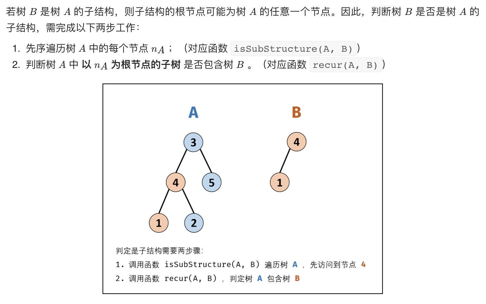

# [剑指 Offer 26. 树的子结构](https://leetcode-cn.com/problems/shu-de-zi-jie-gou-lcof/)

## 解题思路



## 复杂度分析

**时间复杂度：O(MN)**，其中 M，N 分别为树 A 和 树 B 的节点数量；先序遍历树 A 占用 O(M) ，判断子结构占用 O(N) 。

**空间复杂度：O(M)** 

## 代码实现

```golang
func isSubStructure(A *TreeNode, B *TreeNode) bool {
	if B == nil { // 特判
		return false
	}
	// 1、非递归先序遍历 Ad
	stack := list.New()
	node := A
	for node != nil || stack.Len() > 0 {
		for node != nil {
			// 2、递归检查 B 是否为 A 的子结构
			if node.Val == B.Val && isSubTree(node, B) {
				return true
			}
			stack.PushBack(node)
			node = node.Left
		}

		node = stack.Remove(stack.Back()).(*TreeNode)
		node = node.Right
	}
	return false
}

func isSubTree(A *TreeNode, B *TreeNode) bool {
	if B == nil { // 终止条件，先判断 B
		return true
	}
	if A == nil { // 终止条件
		return false
	}
	if A.Val != B.Val { // 终止条件
		return false
	}
	// 递归判断是否为子结构
	return isSubTree(A.Left, B.Left) && isSubTree(A.Right, B.Right)
}
```