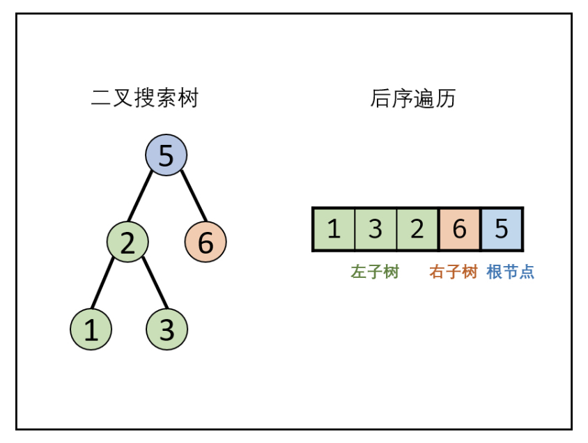
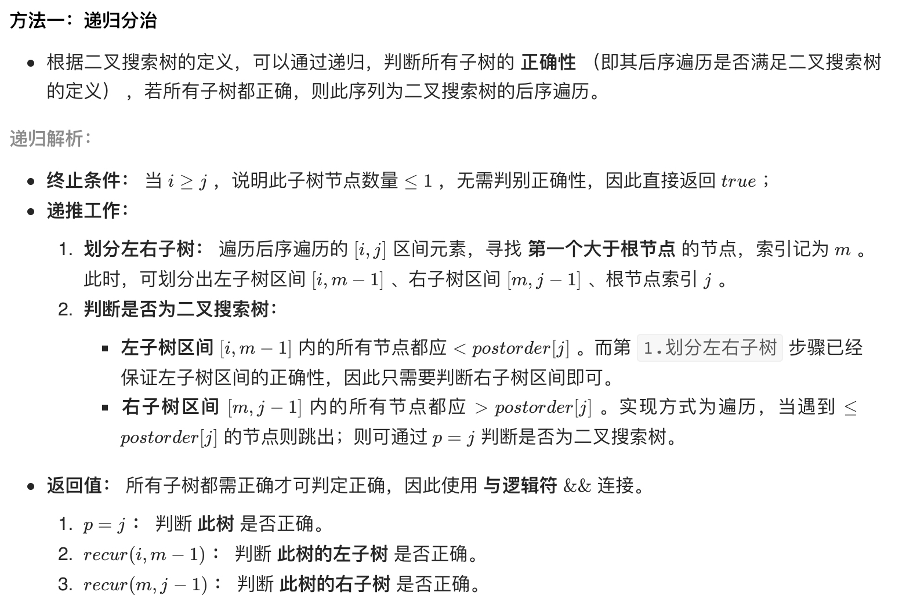
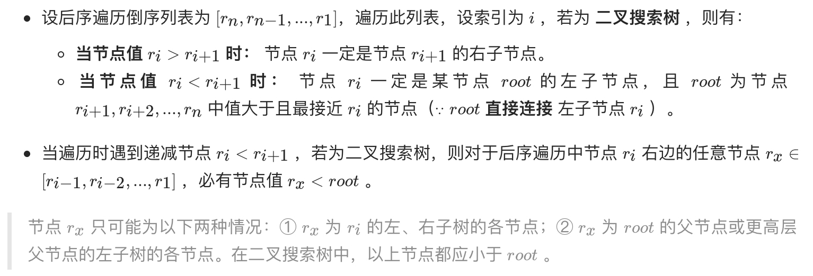
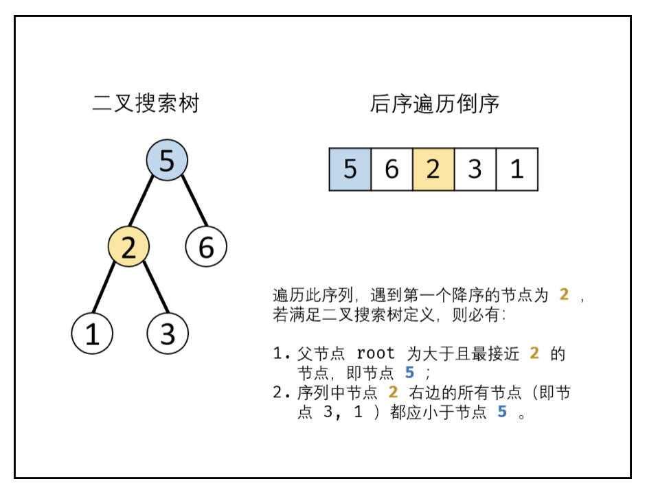
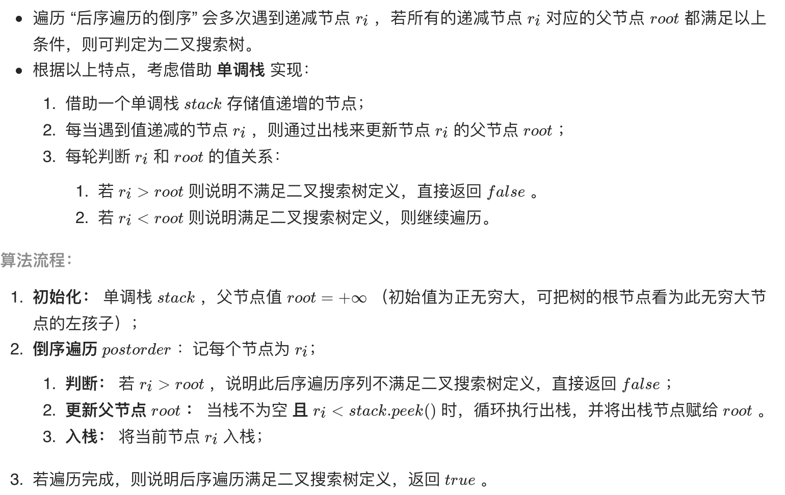

# [剑指 Offer 33. 二叉搜索树的后序遍历序列](https://leetcode-cn.com/problems/er-cha-sou-suo-shu-de-hou-xu-bian-li-xu-lie-lcof/)

## 方法一：递归+分治（推荐）

## 解题思路

**后序遍历定义**： [ 左子树 | 右子树 | 根节点 ] ，即遍历顺序为 “左、右、根” 。
**二叉搜索树定义**： 左子树中所有节点的值 < 根节点的值；右子树中所有节点的值 > 根节点的值；其左、右子树也分别为二叉搜索树。





## 复杂度分析

**时间复杂度：O(N^2)**，每次调用 recur(i,j) 减去一个根节点，因此递归占用 O(N) ；最差情况下（即当树退化为链表），每轮递归都需遍历树所有节点，占用 O(N) 。

**空间复杂度：O(N)** ，最差情况下（即当树退化为链表），递归深度将达到 N 。

## 代码实现

```golang
func verifyPostorder(postorder []int) bool {
	if len(postorder) == 0 {
		return true
	}
	return recur(postorder, 0, len(postorder)-1)
}

func recur(postorder []int, i, j int) bool {
	if i >= j {
		return true
	}
	p, root := i, postorder[j]
	for postorder[p] < root {
		p++
	}
	m := p // 右子树第一个节点
	for postorder[p] > root {
		// p 最大遍历到 j，因为 postorder[j]==root
		p++
	}
	// 根据 p==j 来判断是否为搜索二叉树的后序遍历
	// 即左子树节点都小于根节点，右子树节点都大于根节点
	return p == j && recur(postorder, i, m-1) && recur(postorder, m, j-1)
}
```

## 方法二：递推+辅助单调栈（待补充，思路复杂）

## 解题思路







## 复杂度分析

**时间复杂度：O(N)**

**空间复杂度：O(N)** 

## 代码实现

```golang
// TODO 待补充
```

