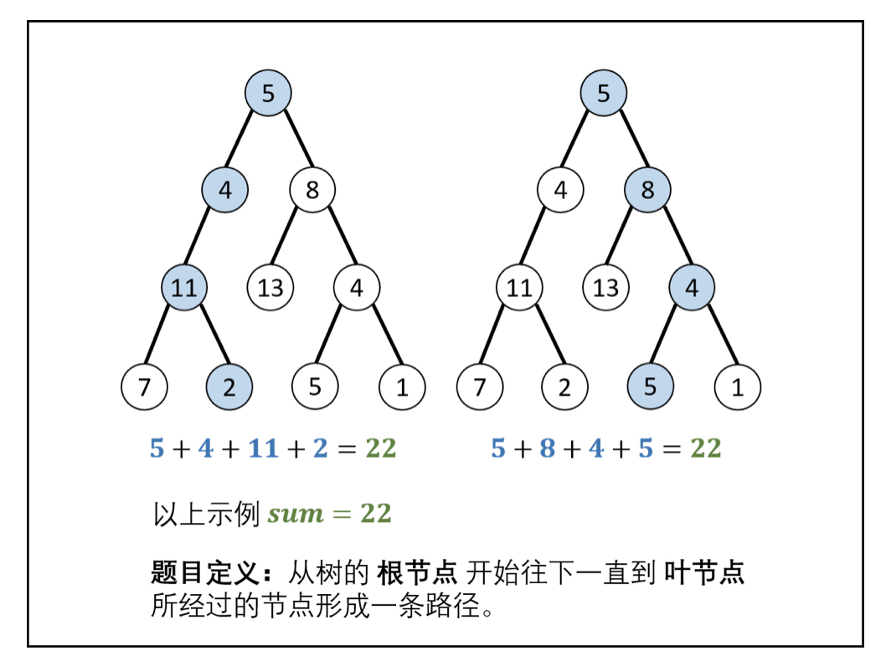
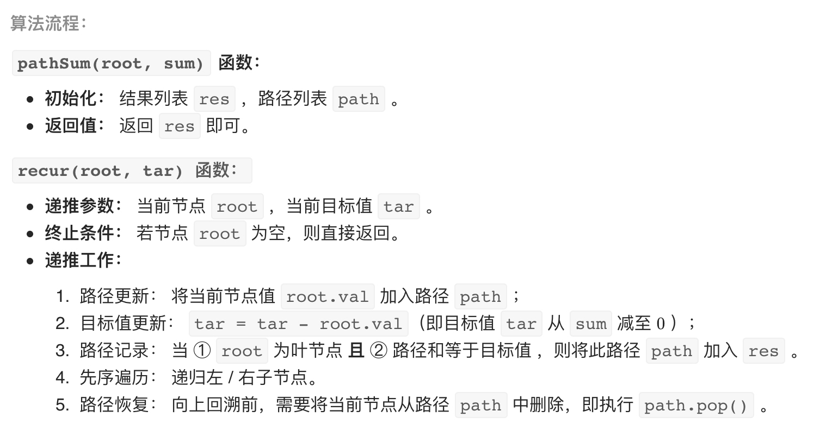

# [剑指 Offer 34. 二叉树中和为某一值的路径](https://leetcode-cn.com/problems/er-cha-shu-zhong-he-wei-mou-yi-zhi-de-lu-jing-lcof/)

## 解题思路

本问题是典型的二叉树方案搜索问题，使用回溯法解决，其包含 **先序遍历 + 路径记录** 两部分。

**先序遍历**： 按照 “根、左、右” 的顺序，遍历树的所有节点。
**路径记录**： 在先序遍历中，记录从根节点到当前节点的路径。当路径 **根节点到叶节点形成的路径** 且 **各节点值的和等于目标值 sum 时**，将此路径加入结果列表。





## 复杂度分析

**时间复杂度：O(N)**

**空间复杂度：O(N)** 

## 代码实现

```golang
func pathSum(root *TreeNode, target int) [][]int {
	var ret [][]int
	dfs(root, target, nil, &ret)
	return ret
}

func dfs(root *TreeNode, target int, item []int, ret *[][]int) {
	if root == nil {
		return
	}
	target = target - root.Val
	// 此处的 item 切片 append 可能会扩容
	// 导致上一层的 item 与函数内的 item 数据不一致
	// 但并不影响逻辑，所以可以不用特殊处理
	item = append(item, root.Val)
	if target == 0 && root.Left == nil && root.Right == nil {
		// path 切片的底层数组可能会被修改
		// 所以需要先 append 到空切片，在 append 到 ret 中
		// 防止 path 底层数据修改后，导致加入到 ret 的切片也发生变化
		*ret = append(*ret, append([]int{}, item...))
		return
	}
	dfs(root.Left, target, item, ret)
	dfs(root.Right, target, item, ret)
	item = item[:len(item)-1]
}
```

## 相关题目

[面试题 04.12. 求和路径](https://github.com/WTongStudio/LeetCode/blob/master/数据结构/树/面试题%2004.12.%20求和路径.md)