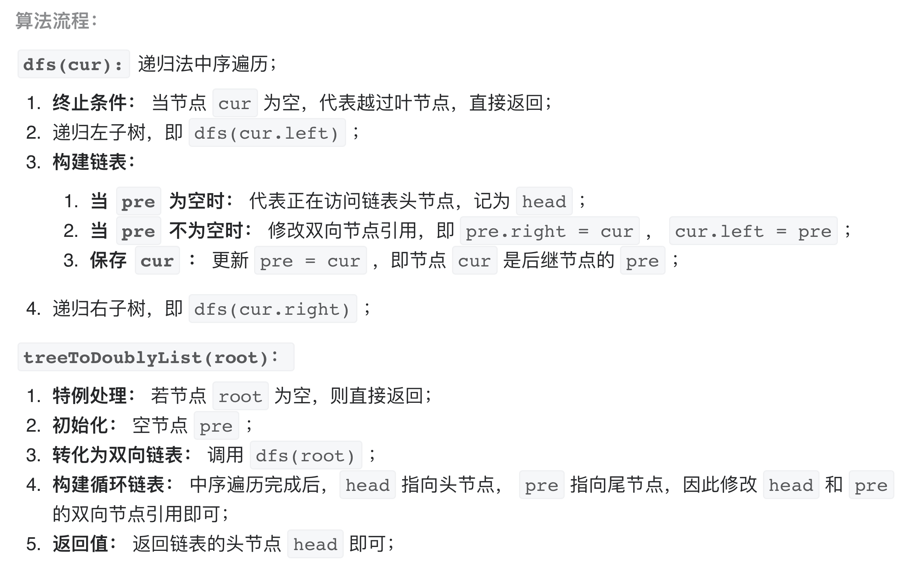

# [剑指 Offer 36. 二叉搜索树与双向链表](https://leetcode-cn.com/problems/er-cha-sou-suo-shu-yu-shuang-xiang-lian-biao-lcof/)

## 解题思路

利用性质：二叉搜索树的中序遍历为 **递增序列** 。

将 二叉搜索树 转换成一个 “排序的循环双向链表” ，其中包含三个要素：

**排序链表**： 节点应从小到大排序，因此应使用 中序遍历 “从小到大”访问树的节点。
**双向链表**： 在构建相邻节点的引用关系时，设前驱节点 pre 和当前节点 cur ，不仅应构建 pre.right = cur ，也应构建 cur.left = pre 。
**循环链表**： 设链表头节点 head 和尾节点 tail ，则应构建 head.left = tail 和 tail.right = head 。




## 复杂度分析

**时间复杂度：O(N)**

**空间复杂度：O(N)** 

## 代码实现

```golang
var prev, head *TreeNode // 全局变量
func treeToDoublyList(root *TreeNode) *TreeNode {
	if root == nil { // 特判
		return nil
	}
	midOrder(root) // 中序递归遍历
	head.Left, prev.Right = prev, head // 循环处理
	return head
}

func midOrder(curr *TreeNode) {
	if curr == nil { // 终止条件
		return
	}
	midOrder(curr.Left) // 递归遍历左子树
	if prev != nil {    // 修改节点指针指向
		prev.Right, curr.Left = curr, prev
	} else { // 记录头节点，即中序遍历访问的第一个节点
		head = curr
	}
	prev = curr
	midOrder(curr.Right) // 递归遍历右子树
}
```