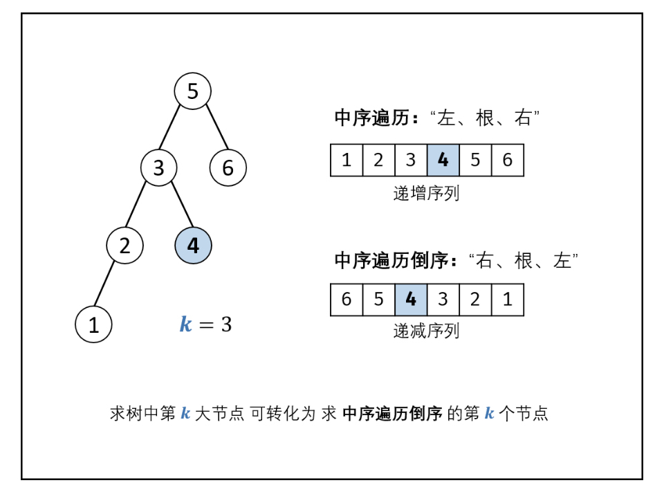

# [剑指 Offer 54. 二叉搜索树的第k大节点](https://leetcode-cn.com/problems/er-cha-sou-suo-shu-de-di-kda-jie-dian-lcof/)

## 解题思路

基于二叉搜索树的性质：二叉搜索树的中序遍历为 **递增序列** 。因此，**求 “二叉搜索树第 k*k* 大的节点” 可转化为求 “此树的中序遍历倒序的第 k 个节点”**。



## 复杂度分析

**时间复杂度：O(N)**

**空间复杂度：O(N)** 

## 代码实现

```golang
func kthLargest(root *TreeNode, k int) int { // 链表模拟栈
	// 1、中序遍历二叉搜索树
	midOrder := make([]int, 0)
	node := root
	stack := list.New()
	for node != nil || stack.Len() > 0 {
		for node != nil {
			stack.PushBack(node)
			node = node.Left
		}
		node = stack.Remove(stack.Back()).(*TreeNode)
		midOrder = append(midOrder, node.Val)
		node = node.Right
	}
	// 2、取倒数第k个节点值
	return midOrder[len(midOrder)-k]
}

//func kthLargest(root *TreeNode, k int) int { // 切片模拟栈
//	// 1、中序遍历二叉搜索树
//	midOrder := make([]int, 0)
//	node := root
//	stack := make([]*TreeNode, 0)
//	for node != nil || len(stack) > 0 {
//		for node != nil {
//			stack = append(stack, node)
//			node = node.Left
//		}
//		node = stack[len(stack)-1]
//		stack = stack[:len(stack)-1]
//		midOrder = append(midOrder, node.Val)
//		node = node.Right
//	}
//	// 2、取倒数第k个节点值
//	return midOrder[len(midOrder)-k]
//}
```