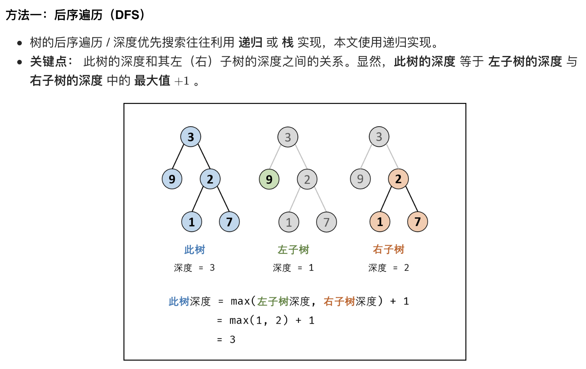

# [剑指 Offer 55 - I. 二叉树的深度](https://leetcode-cn.com/problems/er-cha-shu-de-shen-du-lcof/)

## 方法一：深度优先搜索（后序遍历）

## 解题思路



## 复杂度分析

**时间复杂度：O(N)**

**空间复杂度：O(N)** 

## 代码实现

```golang
func maxDepth(root *TreeNode) int {
	if root == nil { // 特判
		return 0
	}
	return max(maxDepth(root.Left), maxDepth(root.Right)) + 1
}

func max(a, b int) int {
	if a > b {
		return a
	}
	return b
}
```

## 方法二：广度优先搜索（层次遍历，辅助队列）

## 解题思路


## 复杂度分析

**时间复杂度：O(N)**

**空间复杂度：O(N)** 

## 代码实现

```golang
func maxDepth(root *TreeNode) int { // 链表模拟队列
	if root == nil {                // 特判
		return 0
	}
	queue := list.New()
	queue.PushBack(root)
	depth := 0
	for queue.Len() > 0 {
		num := queue.Len() // 记录本层的节点数
		for i := 0; i < num; i++ {
			node := queue.Remove(queue.Front()).(*TreeNode)
			if node.Left != nil {
				queue.PushBack(node.Left)
			}
			if node.Right != nil {
				queue.PushBack(node.Right)
			}
		}
		depth++
	}
	return depth
}

//func maxDepth(root *TreeNode) int { // 切片模拟队列
//	if root == nil {                // 特判
//		return 0
//	}
//	queue := make([]*TreeNode, 0)
//	queue = append(queue, root)
//	depth := 0
//	for len(queue) > 0 {
//		num := len(queue) // 记录本层的节点数
//		for i := 0; i < num; i++ {
//			node := queue[0]
//			queue = queue[1:]
//			if node.Left != nil {
//				queue = append(queue, node.Left)
//			}
//			if node.Right != nil {
//				queue = append(queue, node.Right)
//			}
//		}
//		depth++
//	}
//	return depth
//}
```

