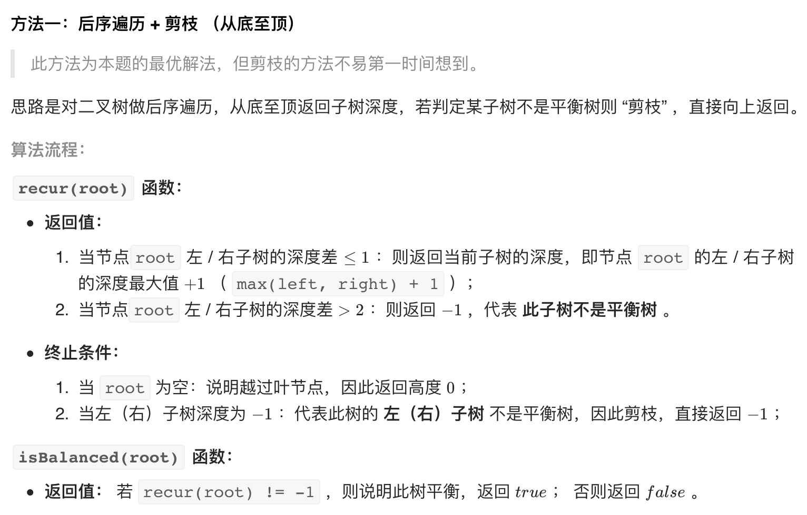

# [剑指 Offer 55 - II. 平衡二叉树](https://leetcode-cn.com/problems/ping-heng-er-cha-shu-lcof/)

## 解题思路

**后序遍历+剪枝**



## 复杂度分析

**时间复杂度：O(N)**

**空间复杂度：O(N)** 

## 代码实现

```golang
func isBalanced(root *TreeNode) bool {
	return recur(root) != -1
}

func recur(root *TreeNode) int { // 若非平衡二叉树返回-1，否则返回树的深度
	if root == nil {
		return 0
	}
	left := recur(root.Left)
	if left == -1 { // 左子树非平衡
		return -1
	}
	right := recur(root.Right)
	if right == -1 { // 右子树非平衡
		return -1
	}
	if left-right > 1 || right-left > 1 { // 不满足平衡二叉树条件
		return -1
	}
	return max(left, right) + 1
}

func max(a, b int) int {
	if a > b {
		return a
	}
	return b
}
```
