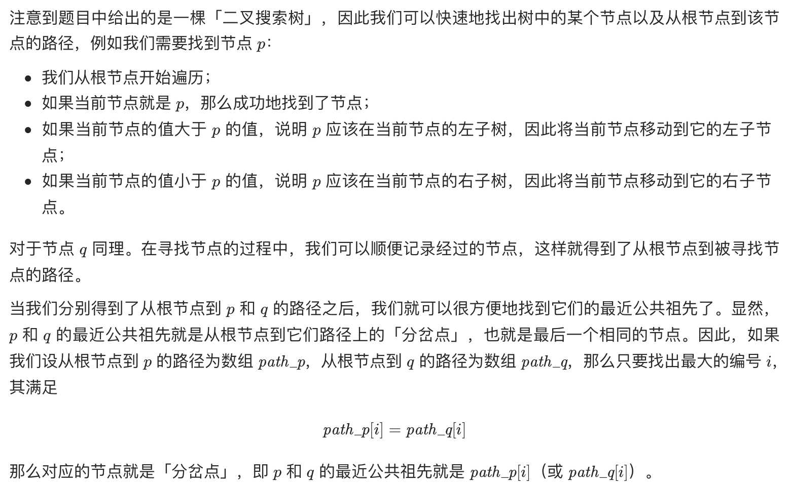
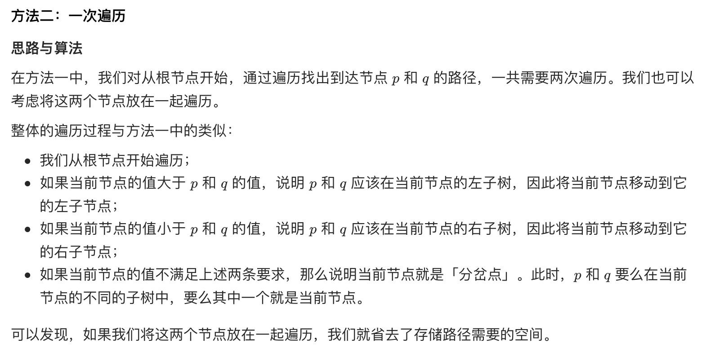

# [剑指 Offer 68 - I. 二叉搜索树的最近公共祖先](https://leetcode-cn.com/problems/er-cha-sou-suo-shu-de-zui-jin-gong-gong-zu-xian-lcof/)

## 方法一：两次遍历

## 解题思路



## 复杂度分析

**时间复杂度：O(N)**

**空间复杂度：O(N)** 

## 代码实现

```golang
func lowestCommonAncestor(root, p, q *TreeNode) *TreeNode {
	pathP := getPath(root, p)
	pathQ := getPath(root, q)
	var ancestor *TreeNode
	for i := 0; i < len(pathP) && i < len(pathQ) && pathP[i] == pathQ[i]; i++ {
		ancestor = pathP[i]
	}
	return ancestor
}

func getPath(root, target *TreeNode) []*TreeNode {
	var path []*TreeNode
	node := root
	for node != target { // 注意此处比较的是节点，而非节点的Val
		path = append(path, node)
		if target.Val < node.Val {
			node = node.Left
		} else {
			node = node.Right
		}
	}
	// 找到的节点也需加入路径，因题意：一个节点也可以是它自己的祖先
	path = append(path, node)
	return path
}
```

## 方法二：一次遍历（推荐）

## 解题思路



## 复杂度分析

**时间复杂度：O(N)**

**空间复杂度：O(1)** 

## 代码实现

```golang
func lowestCommonAncestor(root, p, q *TreeNode) *TreeNode {
	ancestor := root
	for {
		if p.Val < ancestor.Val && q.Val < ancestor.Val {
			ancestor = ancestor.Left
		} else if p.Val > ancestor.Val && q.Val > ancestor.Val {
			ancestor = ancestor.Right
		} else { // 要么p、q在当前节点的不同子树中，要么其中一个就是当前节点
			return ancestor
		}
	}
}
```

