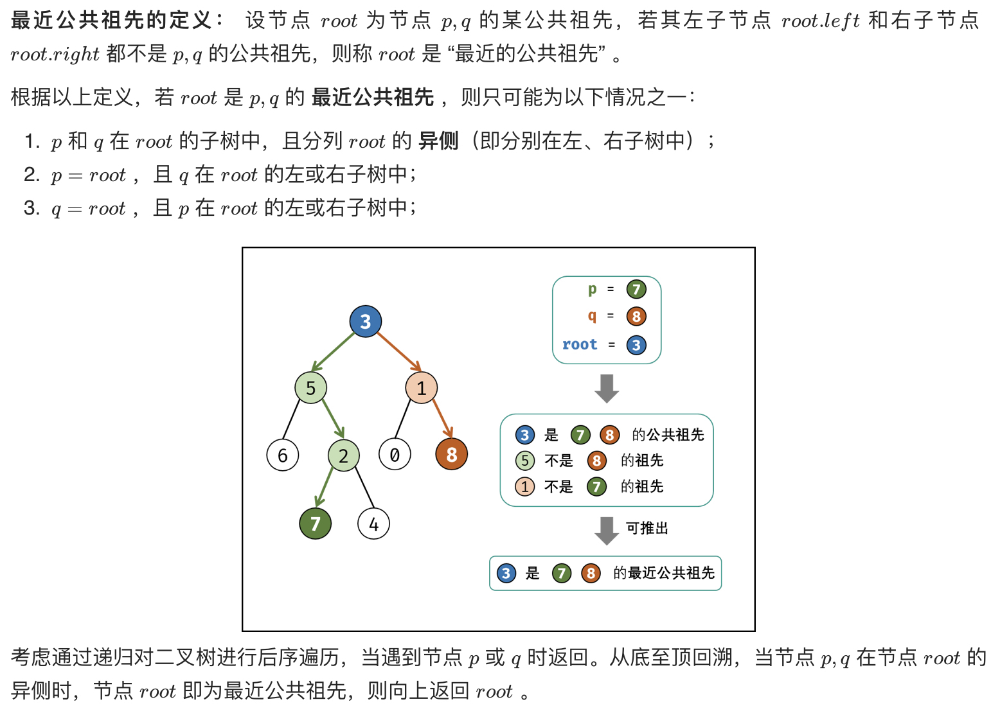
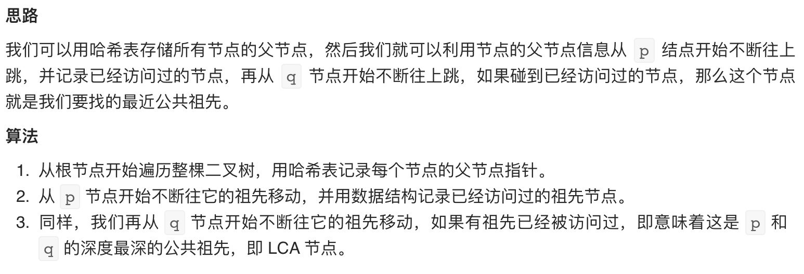

# [剑指 Offer 68 - II. 二叉树的最近公共祖先](https://leetcode-cn.com/problems/er-cha-shu-de-zui-jin-gong-gong-zu-xian-lcof/)

## 方法一：递归（推荐）

## 解题思路

注意：**一个节点也可以是它自己的祖先**



## 复杂度分析

**时间复杂度：O(N)**

**空间复杂度：O(N)** 

## 代码实现

```golang
func lowestCommonAncestor(root, p, q *TreeNode) *TreeNode {
	if root == nil {
		return nil
	}
	if root == p || root == q { // 终止条件，一个节点也可以是它自己的祖先
		return root
	}
	left := lowestCommonAncestor(root.Left, p, q)   // 在左子树查找p、q的最近公共祖先
	right := lowestCommonAncestor(root.Right, p, q) // 在右子树查找p、q的最近公共祖先
	if left != nil && right != nil {
    // 若左、右子树中都存在公共祖先，说明当前节点为最近公共祖先
    // 此时left==root.Left，right==root.Right
		return root
	}
	if left == nil { // 不在左子树
		return right
	}
	return left
}
```

## 方法二：存储父节点

## 解题思路



## 复杂度分析

**时间复杂度：O(N)**

**空间复杂度：O(N)** 

## 代码实现

```golang
func lowestCommonAncestor(root, p, q *TreeNode) *TreeNode {
	parent := map[int]*TreeNode{}
	visited := map[int]bool{}

	var dfs func(*TreeNode) // 此处单独声明，而非短声明（:=）是为了能够闭包传如方法内进行递归
	dfs = func(r *TreeNode) { // 递归中序遍历
		if r == nil {
			return
		}
		if r.Left != nil {
			parent[r.Left.Val] = r
			dfs(r.Left)
		}
		if r.Right != nil {
			parent[r.Right.Val] = r
			dfs(r.Right)
		}
	}
	dfs(root)
	for p != nil {
		visited[p.Val] = true // 标记访问过的节点
		p = parent[p.Val]
	}
	for q != nil {
		if visited[q.Val] { // 若已被访问则为最近公共祖先
			return q
		}
		q = parent[q.Val]
	}
	return nil
}
```

