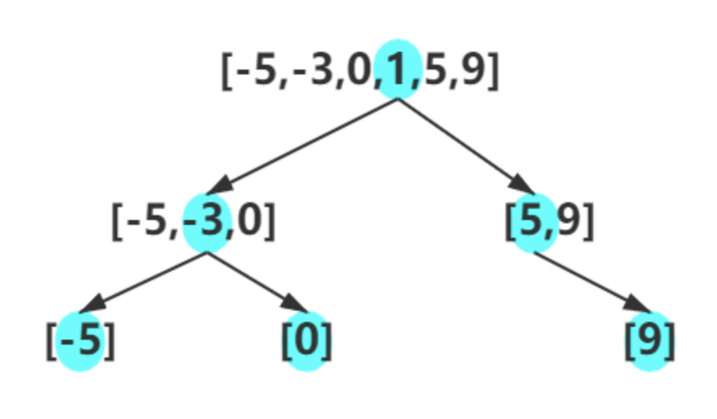

# [面试题 04.02. 最小高度树](https://leetcode-cn.com/problems/minimum-height-tree-lcci/)

## 解题思路

二叉搜索树的定义：对于树中的所有子树都有，左子树上的值都小于根节点的值，右子树上的值都大于根节点上的值。总结一下就是，树的中序遍历可以得到一个升序序列。

那如何保证高度最小呢？当树中的任意结点的左右子树高度差都不超过 1 时，整棵树的深度最小，具体思路：

- 如果序列长度为 0，那么是一棵空树。
- 如果序列长度为 1，那么只有一个根节点。
- 如果长度大于 1，那么选取中间位置的数赋给根节点，然后前一半递归构建左子树，后一半递归构建右子树。

以 [-5,-3,0,1,5,9] 为例，构造过程如下图所示：



## 复杂度分析

**时间复杂度：O(N)**

**空间复杂度：O(N)** 

## 代码实现

```golang
func sortedArrayToBST(nums []int) *TreeNode {
	n := len(nums)
	if n == 0 { // 特判
		return nil
	}
	if n == 1 { // 特判
		return &TreeNode{Val: nums[0]}
	}
	root := &TreeNode{Val: nums[n/2]}           // 取中点作为根节点
	root.Left = sortedArrayToBST(nums[:n/2])    // 递归生成左子树
	root.Right = sortedArrayToBST(nums[n/2+1:]) // 递归生成右子树
	return root
}
```