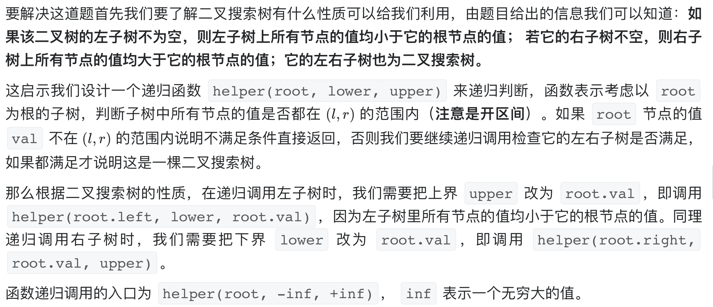

# [面试题 04.05. 合法二叉搜索树](https://leetcode-cn.com/problems/legal-binary-search-tree-lcci/)

## 方法一：递归

## 解题思路



## 复杂度分析

**时间复杂度：O(N)**

**空间复杂度：O(N)** 

## 代码实现

```golang
func isValidBST(root *TreeNode) bool {
	return helper(root, math.MinInt64, math.MaxInt64)
}

func helper(root *TreeNode, lower, upper int) bool {
	if root == nil { // 空树也算二叉搜索树
		return true
	}
	if root.Val <= lower || root.Val >= upper {
		return false
	}
	// 遍历判断每个节点是否在 lower~upper 范围内
	return helper(root.Left, lower, root.Val) && helper(root.Right, root.Val, upper)
}
```

## 方法二：中序遍历

## 解题思路

基于方法一中提及的性质，可以进一步知道**二叉搜索树「中序遍历」得到的值构成的序列一定是升序的**，这启示我们**在中序遍历的时候实时检查当前节点的值是否大于前一个中序遍历到的节点的值即可**。如果均大于说明这个序列是升序的，整棵树是二叉搜索树，否则不是，下面的代码我们使用栈来模拟中序遍历的过程。

## 复杂度分析

**时间复杂度：O(N)**

**空间复杂度：O(N)**，栈最多存储 n 个节点，因此需要额外的 O(n) 的空间。 

## 代码实现

```go
func isValidBST(root *TreeNode) bool {
	max := math.MinInt64 // 注意数值范围，这里用 MinInt32 会不够
	// 非递归中序遍历
	stack := make([]*TreeNode, 0) // 数组模拟栈
	node := root
	for node != nil || len(stack) > 0 {
		for node != nil {
			stack = append(stack, node)
			node = node.Left
		}
		node = stack[len(stack)-1]
		stack = stack[:len(stack)-1]
		if max >= node.Val { // 判断是否严格递增
			return false
		}
		max = node.Val
		node = node.Right
	}
	return true
}
```

