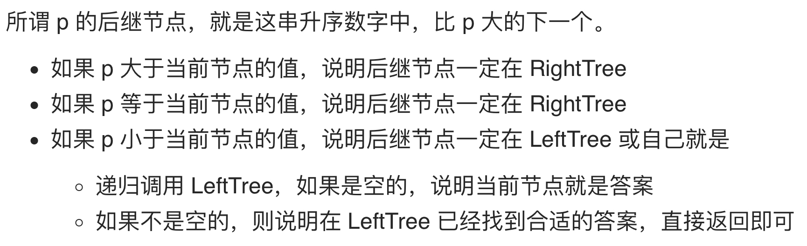

# [面试题 04.06. 后继者](https://leetcode-cn.com/problems/successor-lcci/)

## 方法一：递归

## 解题思路



## 复杂度分析

**时间复杂度：O(logN)**

**空间复杂度：O(logN)** 

## 代码实现

```golang
func inorderSuccessor(root *TreeNode, p *TreeNode) *TreeNode {
	if root == nil || p == nil {
		return nil
	}
	if p.Val >= root.Val { // 若 p 节点大于等于当前节点的值，则后继节点一定在右子树中
		return inorderSuccessor(root.Right, p)
	} else { // 若 p 小于当前节点的值，说明后继节点一定在左子树中 或 是它自己
		nextNode := inorderSuccessor(root.Left, p)
		if nextNode == nil {
			return root
		}
		return nextNode
	}
}
```

## 方法二：非递归

## 解题思路


## 复杂度分析

**时间复杂度：O(logN)**

**空间复杂度：O(1)** 

## 代码实现

```go
func inorderSuccessor(root *TreeNode, p *TreeNode) *TreeNode {
	if root == nil || p == nil {
		return nil
	}
	if p.Right!=nil{
		node:=p.Right
		for node.Left!=nil{
			node=node.Left
		}
		return node
	}

}
```

