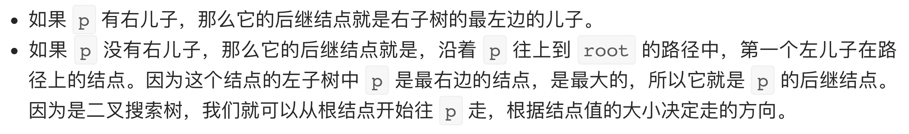

# [面试题 04.06. 后继者](https://leetcode-cn.com/problems/successor-lcci/)

## 方法一：递归

## 解题思路


## 复杂度分析

**时间复杂度：O(logN)**

**空间复杂度：O(logN)** 

## 代码实现

```golang
func inorderSuccessor(root *TreeNode, p *TreeNode) *TreeNode {
	if root == nil || p == nil {
		return nil
	}
	if p.Val >= root.Val { // 若 p 节点大于等于当前节点的值，则后继节点一定在右子树中
		return inorderSuccessor(root.Right, p)
	} else { // 若 p 小于当前节点的值，说明后继节点一定在左子树中 或 是它自己
		nextNode := inorderSuccessor(root.Left, p)
		if nextNode == nil {
			return root
		}
		return nextNode
	}
}
```

## 方法二：递推

## 解题思路



## 复杂度分析

**时间复杂度：O(logN)**

**空间复杂度：O(1)** 

## 代码实现

```go
func inorderSuccessor(root *TreeNode, p *TreeNode) *TreeNode {
	if root == nil || p == nil {
		return nil
	}
	if p.Right != nil { // 情况1：如果 p 有右儿子，则后继结点就是右子树的最左边的儿子
		node := p.Right
		for node.Left != nil {
			node = node.Left
		}
		return node
	}
	// 情况2：如果 p 没有右儿子，则后继结点就是，沿着 p 往上到 root 的路径中，第一个左儿子在路径上的结点
	// 递推逻辑需要反过来从 root 往下找
	var prev *TreeNode
	node := root
	for node != p {
		if node.Val < p.Val { // 从上至下顺着 root 的右子树查找
			node = node.Right
		} else { // 找到转折点时，表示之后的节点都为当前节点的左子树，则标记（标记会不断更新至离 p 最近的父节点或 p 本身）
			prev = node      // p 在 prev 节点的左子树，或 p==prev
			node = node.Left // 顺着左子树继续找
		}
	}
	return prev
}
```

