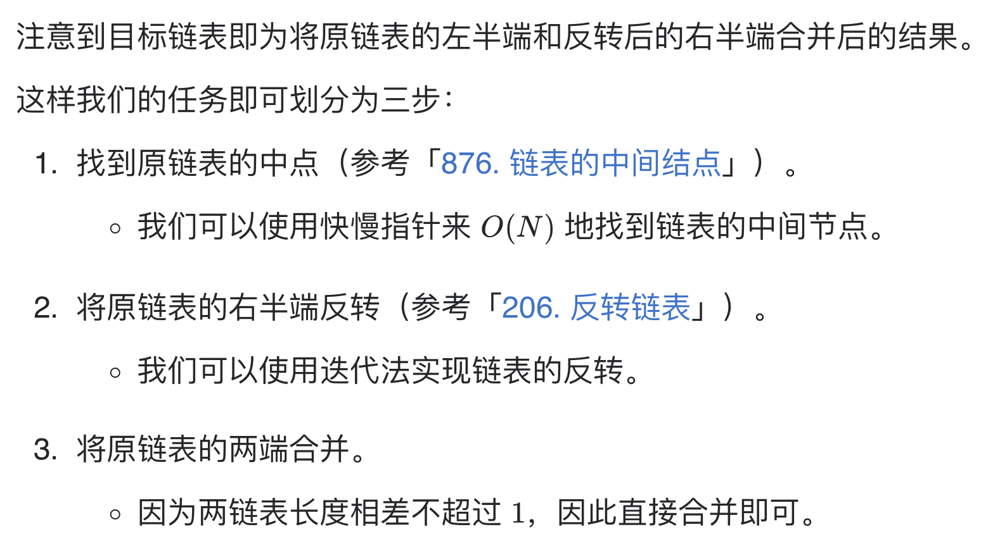

# [143. 重排链表](https://leetcode-cn.com/problems/reorder-list/)

## 解题思路



## 复杂度分析

**时间复杂度：O(N)**

**空间复杂度：O(1)** 

## 代码实现

```golang
func middleNode(head *ListNode) *ListNode { // 链表中点
	slow, fast := head, head
	for fast.Next != nil && fast.Next.Next != nil { // 注意条件，要获取前半段最后节点
		slow = slow.Next
		fast = fast.Next.Next
	}
	return slow
}

func reverseList(head *ListNode) *ListNode { // 反转链表
	var prev *ListNode
	curr := head
	for curr != nil {
		next := curr.Next
		curr.Next = prev
		prev = curr
		curr = next
	}
	return prev
}

func reorderList(head *ListNode) {
	if head == nil {
		return
	}
	// 1、获取链表中点
	mid := middleNode(head)
	l1 := head
	l2 := mid.Next
	mid.Next = nil // 注意截断
	// 2、反转后半段链表
	l2 = reverseList(l2)
	// 3、交叉合并两个链表
	for l1 != nil && l2 != nil {
		next1 := l1.Next
		next2 := l2.Next

		l1.Next = l2
		l2.Next = next1

		l1 = next1
		l2 = next2
	}
}
```